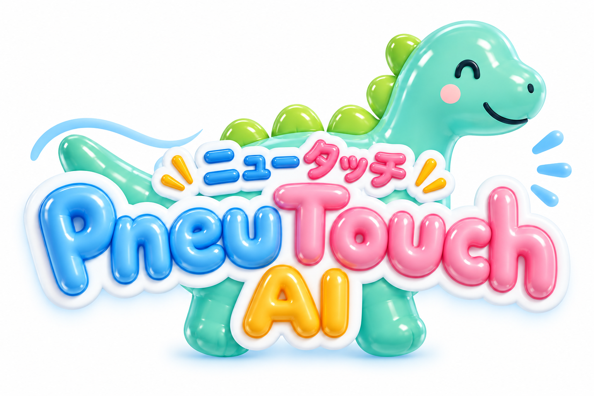
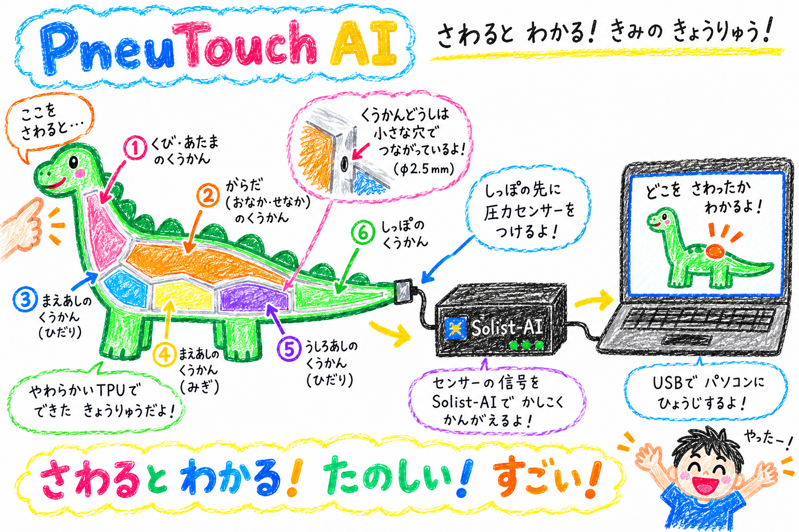
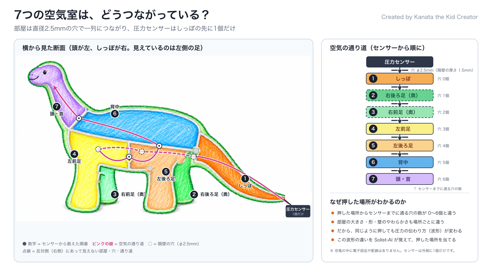
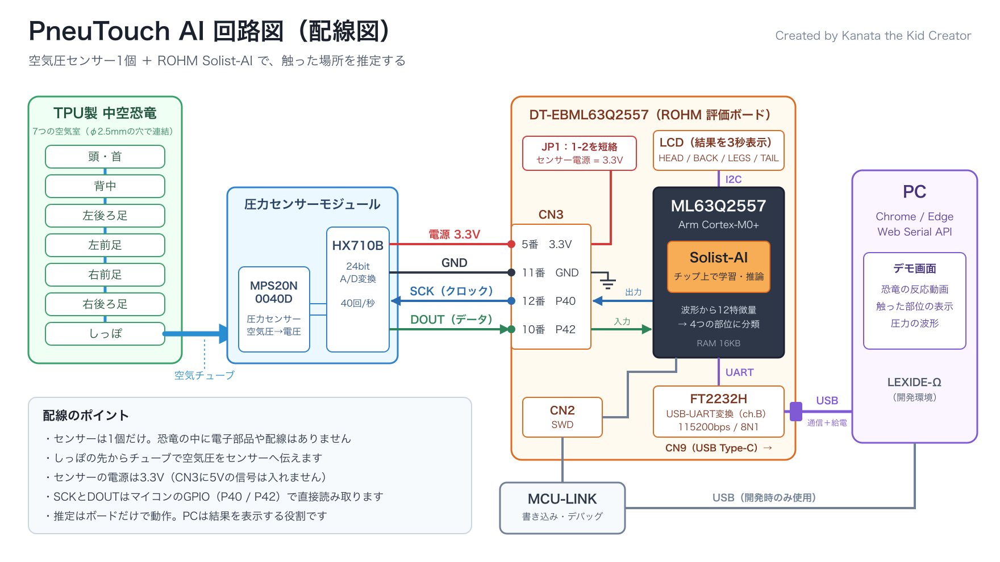
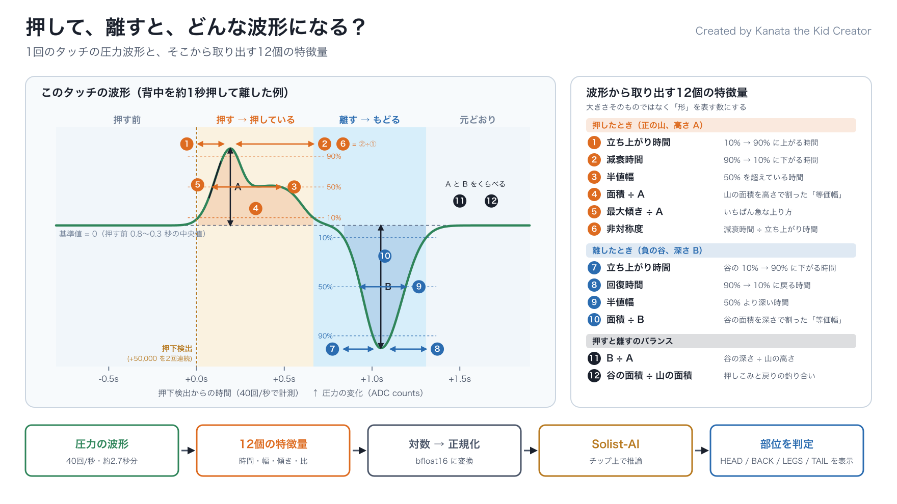

<!-- Project entry point: what the system is, how it works, and how to run it. -->
# PneuTouch AI



**Created by Kanata the Kid Creator.**

やわらかいTPU製の中空恐竜を7つの空気室に分け、
**たった1個の空気圧センサーの波形から「どこを触られたか」を推定する**システムです。
推定はROHMのマイコン ML63Q2557 に搭載された Solist-AI で行い、学習も推論もチップの中だけで完結します。
触った場所に応じて、画面の中の恐竜が反応します。

ROHM EDGE HACK CHALLENGE 2026（REHC2026）の応募作品です。

| | リンク |
|---|---|
| 作品ページ（ProtoPedia） | <https://protopedia.net/prototype/9781> |
| デモ動画（YouTube） | <https://youtu.be/TioNkfCQrJ0> |

## システム構成



## しくみ

ふつう、7か所のタッチを検出するには7個のセンサーが必要です。
PneuTouch AI は、センサーを増やす代わりに**恐竜の「形」に情報を持たせます**。

1. **恐竜を押す** — 約1秒押して離すと、その空気室の空気が押し出されます。
2. **空気が伝わる** — 空気室は小さな穴でつながっており、圧力の変化がしっぽの先のセンサーまで伝わります。
   押した場所によって通る道のりや部屋の大きさが違うので、圧力の伝わり方が変わります。
3. **圧力を測る** — 圧力センサー MPS20N0040D の信号を HX710B が24 bitのデジタル値に変換します（40回/秒）。
4. **特徴を取り出す** — 立ち上がり・減衰・半値幅・正負ピーク比など、波形の形を表す12個の特徴量を計算します。
5. **AIが推定する** — Solist-AI が `HEAD / BACK / LEGS / TAIL` のどれかに分類します。
6. **結果を表示する** — ボードのLCDに3秒表示し、USBでPCへ送ります。
7. **恐竜が反応する** — ブラウザーのデモ画面が、部位に応じた動画・画像・実測波形を表示します。

圧力の大きさではなく、**圧力が伝わる過程（過渡波形）**を見ている点が特徴です。
恐竜の中には電子部品も配線も入っていません。

### 7つの空気室

| Zone | 部位 | 分類クラス |
|---:|---|---|
| 1 | しっぽ | `TAIL` |
| 2 | 背中・胴体 | `BACK` |
| 3 | 右後ろ足 | `LEGS` |
| 4 | 左後ろ足 | `LEGS` |
| 5 | 右前足 | `LEGS` |
| 6 | 左前足 | `LEGS` |
| 7 | 首・頭 | `HEAD` |

空気室は次の順につながっています。外殻と隔壁の厚さは1.5 mm、隔壁の穴は直径2.5 mmです。

```text
センサー → しっぽ → 右後ろ足 → 右前足 → 左前足 → 左後ろ足 → 背中 → 頭
```



## ハードウェア

| 部品 | 役割 |
|---|---|
| TPU製の中空恐竜（3Dプリント） | 触られる本体。7つの空気室を持つ |
| MPS20N0040D + HX710B モジュール | 空気圧センサーと24 bit A/D変換 |
| DT-EBML63Q2557 | ROHM ML63Q2557（Arm Cortex-M0+、Solist-AI）搭載の評価ボード |
| MCU-LINK | ファームウェアの書き込み・デバッグ |
| PC（Chrome / Edge） | デモ画面の表示 |

### 回路図



| センサーモジュール | DT-EBML63Q2557 | マイコン |
|---|---|---|
| VCC | CN3-5（3.3V） | — |
| GND | CN3-11 | — |
| SCK | CN3-12 | P40（GPIO出力） |
| DOUT | CN3-10 | P42（GPIO入力） |

- JP1は1–2を短絡してセンサー電源を3.3Vにします。CN3に5Vの信号は入れません。
- PCとの通信はCN9（USB Type-C）。FT2232HのチャネルBがUARTで、115200 baud / 8N1 / フロー制御なしです。
- MCU-LINKはCN2（SWD）に接続します。

詳しくは[ボード・センサー・配線](docs/hardware.md)を参照してください。

## ソフトウェア

| 場所 | 言語 | 内容 |
|---|---|---|
| `src/pneutouch-solist` | C | ファームウェア（プロジェクト名 `PneutouchAi`）。センサー読み取り、特徴抽出、Solist-AIの学習・推論、LCD表示、UART送信 |
| `src/demo-visualizer` | JavaScript | デモ画面。Web Serial APIで推定結果を受け取り、動画・部位画像・波形を表示 |
| `src/learning-tool` | JavaScript / Python | 波形の表示とCSV保存を行う計測ツール |
| `src/shared` | JavaScript | シリアル接続、通信の解析、記録の共通処理 |
| `tools` | Python | 波形の分析、学習データの生成、設定ヘッダーの生成、ローカルサーバー |
| `tests` | C / Python / JavaScript | PC上で動かすテスト |

自作のファームウェアは `src/pneutouch-solist/S_PneuTouch` にあります。

### AIモデル



| 項目 | 内容 |
|---|---|
| 入力 | 波形から計算した12特徴量 |
| 構成 | 12入力・隠れ層32・4出力 |
| 学習 | 電源投入時に、FLASHへ格納した60イベントからチップ上で自動学習（約0.5秒） |
| 推定 | 前処理を含めて約5ミリ秒 |
| 2段階判別 | 1段目が `HEAD` か `LEGS` を返したとき、専用モデルで判別し直す |

推定に使うのはその場のセンサーの値だけで、推定時にPCの操作は要りません。
モデルの詳細は[ライブデモの実装](docs/live-pressure-demo-20260920.md)と
[頭と足の判別](docs/head-legs-refinement-20260920.md)を参照してください。

### 通信

ボードはUARTで次の行を送ります。ブラウザー側で分類し直すことはありません。

| 出力 | 意味 |
|---|---|
| `PNEU1,seq,ms,raw` | センサーの生値 |
| `# PNEE1` / `# PNEF1` | 検出したイベントと12特徴量 |
| `# PNEC1,id,ms,label,...` | 推定結果とスコア |
| `# PNEL1,label,ms` | LCDの表示 |

## 使い方

### 1. ファームウェアを書き込む

LEXIDE-Ωで `src/pneutouch-solist` を開きます。

1. **PneutouchAi (in pneutouch-solist)** を選び、**Debug** でビルド。
2. **PneutouchAi Write** をDebugとして起動して書き込み。
3. LCDに `READY` が出たら、約2秒待ってから恐竜を押します。

手順の詳細は[配線・ビルド・計測手順](docs/phase0-bringup.md)と
[Mac / Windowsでの開発方法](docs/development-workflow.md)にあります。

### 2. デモ画面を開く

```sh
python tools/serve_demo.py
```

Chrome / Edgeで <http://localhost:8001/demo-visualizer/> を開き、
「恐竜につなぐ」からCN9のUARTポート（開発環境ではCOM7）を選びます。
表示の仕様は[HTMLデモ](src/demo-visualizer/README.md)を参照してください。

### 3. 波形を見る・記録する

```sh
python tools/serve.py
```

<http://localhost:8000/learning-tool/> を開いて同じポートに接続します。
同じシリアルポートを複数の画面で同時に開くことはできません。

### 設定の変更とテスト

```sh
python tools/generate_config.py   # config.py から設定ヘッダーを生成
python tools/test.py              # PC上のテストを実行
```

## ディレクトリ構成

```text
pneutouch-ai-rehc2026/
├── 3d-models/     # 恐竜の3Dモデル（STL / 3MF）
├── config.py      # 設定の原本
├── docs/          # 設計・手順・検証記録
├── images/        # ロゴ、デモ画像、構成図、回路図
├── src/           # ファームウェアとPCアプリ
├── tests/         # テスト
├── tools/         # 分析・生成・起動スクリプト
└── videos/demo/   # デモ画面で再生する動画
```

## ドキュメント

- [ドキュメント一覧](docs/README.md)
- [コンセプト](docs/concept.md) / [企画の核と検証方針](docs/product-design.md)
- [ボード・センサー・配線](docs/hardware.md)
- [ディレクトリ構成とアプリの役割](docs/architecture.md)
- [Solist-AI実機での学習・比較結果](docs/solist-chip-validation-20260920.md)
- [隔壁・穴径によるフィルタ設計の検討](docs/pneumatic-filter-design-20260920.md)

実測データと検証の記録は `docs/analysis/` にあります。

## ライセンス

Copyright 2026 Kanata the Kid Creator

このプロジェクトは [Apache License 2.0](LICENSE) で公開しています。
次の部分は提供元の著作権表示と条件に従います。詳しくは [NOTICE](NOTICE) を参照してください。

- `src/pneutouch-solist` のうち `S_PneuTouch` 以外は、ROHM Co., Ltd. が配布するドライバー、
  サンプルコード、Solist-AIライブラリーに基づいています。
- 恐竜の外形は [Cute Stylized Dinosaur Toy](https://www.printables.com/model/489585-cute-stylized-dinosaur-toy) をベースにしています。
  内部の空気室・隔壁・穴・圧力取り出し口は独自に設計しました。
