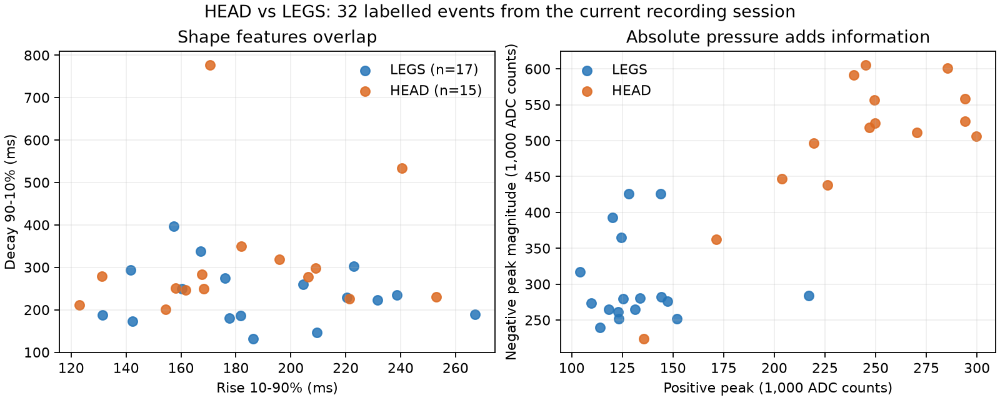

# PneutouchAI — HEAD/LEGSの判別改善

Copyright (C) 2026 Kanata the Kid Creator

## 結論と現在の状態

「HEADがLEGSになる、ほかはおおむねOK」という実操作の報告を受け、
HEAD/LEGS専用モデルを加えた2段階判別を実装し、Debugビルドを実機へ書き込んだ。
通常モデルのTAIL/BACK結果を維持し、HEAD/LEGSの場合だけ再判別する。
どちらもSolist-AIチップで推定し、CPUによる部位の決め打ちは使わない。

保存済み60件を4分割した探索比較では、全体41/60→52/60、HEAD 10/15→15/15、
LEGS 6/17→12/17。TAIL 16/16、BACK 9/12は同じだった。
最終ファームウェアの学習済み60件の再現は56/60、HEAD 15/15。
**いずれも別日・別操作の独立評価ではない。書き込み後、ユーザーからHEADとLEGSは
「半々くらい」と報告があり、実押下では十分な判別に至っていない。**
個々の操作と正解を対応づけた追加記録はまだなく、この報告を数値的な評価精度には換算しない。

## 何が区別に使えたか

HEAD 15件とLEGS 17件は立ち上がり・半値幅・回復時間などの分布が重なっていた。
正圧ピークの中央値はHEAD 246,804 counts、LEGS 125,414 countsで、
この記録では圧力の大きさに有用な差があった。
ただし、押す強さや位置が変わっても常に同じ差になるとは限らない。
これらは基準圧からのADC差分で、校正されたkPaではない。

従来の非対称度は「減衰時間 / 立ち上がり時間」。両時間がすでに入力に含まれ、
対数変換後は2入力の差になるため、専用モデルではこの位置を正圧ピークへ置き換えた。
入力数は12のまま、既存のC特徴抽出・イベント検出・PNEF1ログは変更しない。
専用モデル内では0始まりの入力5が `positive_peak_counts / 1000` になる。

## 比較方法と結果

各クラスの時系列を4つの連続ブロックに分け、各回1ブロックを検証、残り3ブロックを学習に使用。
正規化の平均・標準偏差は各回の学習側だけで計算した。
全推定は実チップ、seed=1・4エポック・hard sigmoid・Beta=0/P=単位行列。
既に観察した同一日の記録を再利用した開発用比較であり、保留テストと呼ばない。
比較を見て案を選んだことによる楽観的な偏りもある。

| モデル | 隠れ数 | 正規化の標準偏差倍率 | 全体 / 60 | HEAD / 15 | LEGS / 17 |
|---|---:|---:|---:|---:|---:|
| 従来の形状12 | 32 | 3 | 41 | 10 | 6 |
| 非対称度→正圧ピーク | 32 | 3 | 50 | 8 | 15 |
| 非対称度→負圧ピーク | 32 | 3 | 51 | 9 | 15 |
| 従来の形状12 | 64 | 3 | 40 | 9 | 6 |
| 非対称度→正圧ピーク | 64 | 3 | 50 | 7 | 15 |
| 非対称度→負圧ピーク | 64 | 3 | 51 | 8 | 15 |
| 従来の形状12 | 32 | 1 | 43 | 9 | 8 |
| 非対称度→正圧ピーク | 32 | 1 | 46 | 8 | 13 |
| 非対称度→負圧ピーク | 32 | 1 | 45 | 8 | 13 |
| 通常＋形状12の専用判別 | 32＋32 | 3 | 40 | 7 | 8 |
| **通常＋正圧ピーク12の専用判別（採用）** | **32＋32** | **3** | **52** | **15** | **12** |
| 通常＋負圧ピーク12の専用判別 | 32＋32 | 3 | 51 | 14 | 12 |

単段モデルへの圧力追加は全体の正解数が増えてもHEADの正解数が減ったため、そのまま採用しなかった。
専用モデルは各回の学習データからHEAD/LEGSだけを取り、両クラス専用の正規化を行う。
通常モデルのHEAD/LEGS判定にだけ適用する。TAIL/BACKへの誤判定はこの段では訂正できない。

採用案の4分割合計（行=正解、列=判定）：

| | TAIL | BACK | LEGS | HEAD |
|---|---:|---:|---:|---:|
| TAIL | 16 | 0 | 0 | 0 |
| BACK | 0 | 9 | 0 | 3 |
| LEGS | 3 | 1 | 12 | 1 |
| HEAD | 0 | 0 | 0 | 15 |

## 実装と最終ファームウェアの確認

AIインスタンス0は以前の60件の通常モデルをそのまま学習。
インスタンス1は同じ記録内のHEAD 15件＋LEGS 17件を専用に学習する。
最終学習は240＋128=368ステップ、起動時521,064µs。
前処理の対数11個を共有し、専用段で増える対数計算は圧力ピークの1個のみとした。
RAM予約量はスタック込み8,576 / 16,384 bytes。

明示的な検証モードの `LIVEINIT` / `LIVEPREDICT` で、FLASHから両モデルを学習する
実際のファームウェアへ60件のfloat32特徴とピークを渡した。教師ラベルは送っていない。
通常モードへ保存波形を流した検証ではなく、センサー取得を止めた専用の検証操作である。
全60件で通常モデルの一次判定が改良前と一致し、TAIL/BACKには専用段が呼ばれないことを確認。
最終再現はTAIL 16/16、BACK 11/12、LEGS 14/17、HEAD 15/15、合計56/60。
同じ学習データに対する再現性の値なので、一般化精度としては扱わない。

前処理込みの推定処理は通常段だけで中央値3,752µs、専用段込みで中央値4,717µs、最大4,788µs。
圧力イベントが完了するまでの観察時間、特徴抽出、UART送信、LCD転送はこの時間に含まれない。
LCDの3秒表示ロジックは維持した。

C 7スイート、Python 22件中21成功・1環境依存スキップ、JavaScript 7件成功。
2モデルの初期化、教師入力、専用段のbfloat16値、HEAD/LEGSの相互訂正、
TAIL/BACKの維持、非有限値、両段のタイムアウト、検証コマンドの隔離を確認。
Debug差分ビルドはエラー0・警告0（前段の全体ビルドには既存UART警告6件があった）。
書き込み後は起動学習とLCD ACK、377センサーサンプルの欠番なしを確認。
60件の検証後は通常モデルを再学習して検出へ戻し、実センサー119サンプルを受信した。

## 記録と再実行

`docs/analysis/2026-09-20-live-calibration/` に保存：

- `head-legs-feature-summary.json`：特徴分布の記述統計。
- `head-legs-feature-comparison*.json` / `.uart.log`：全分割、前処理、スコア、比較過程。
- `specialist-build.json`：バイナリ・ソースのハッシュ、ビルド、メモリ、検証状況。
- `specialist-boot-monitor.*`：受信専用の起動確認。
- `specialist-firmware-check.*`：書き込んだ2モデルと検証後の通常動作復帰。

比較は `python tools/compare_head_legs_features.py`、追加条件は `--hidden 64`、
`--scale-divisor 1`、`--specialist`。モデル生成は `tools/generate_pressure_model.py`。
ビルド・書き込み後の統合確認は `python tools/check_live_models.py`。
検証はCOM7を使用して一時的に通常検出を止め、終了時に通常動作へ復帰する。
配線はCN9 UART-B=COM7、CN9 SPI-A=COM6、MCU-LINK=COM4/COM5。

次の実押下で、弱く押す頭と強く押す足でも区別できるかを確認する必要がある。
HEAD/LEGSの実操作の誤判定は未解決であり、押下・解放・回復の各段階を再分析する。
