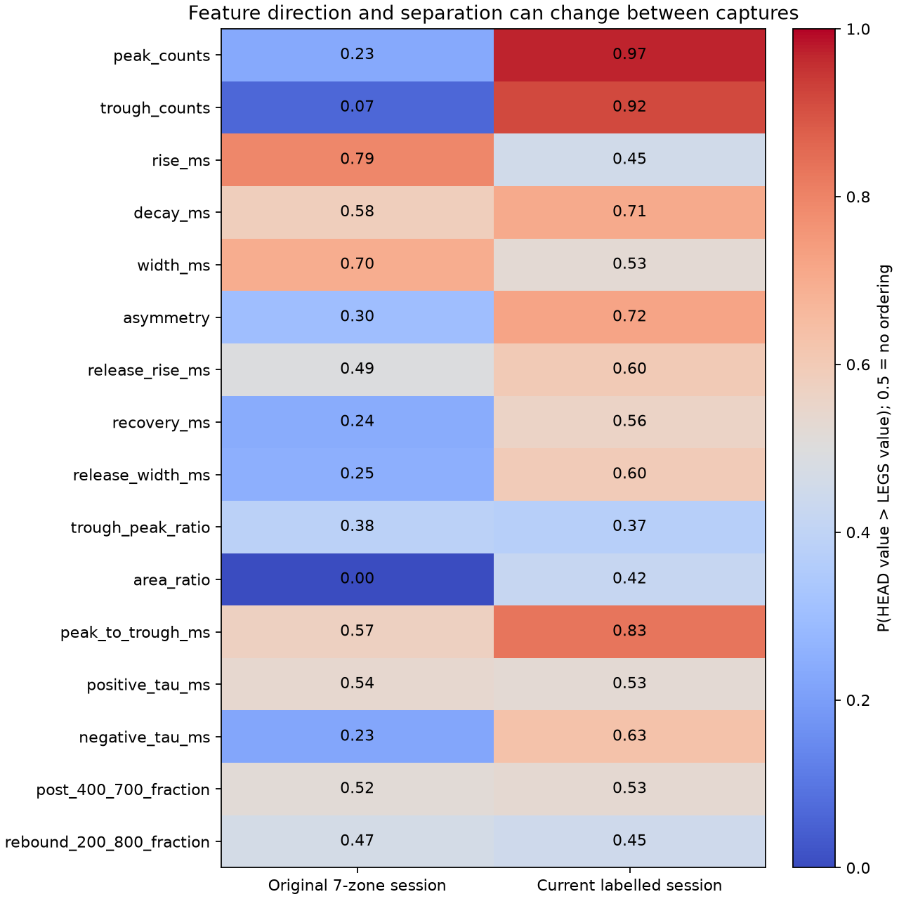
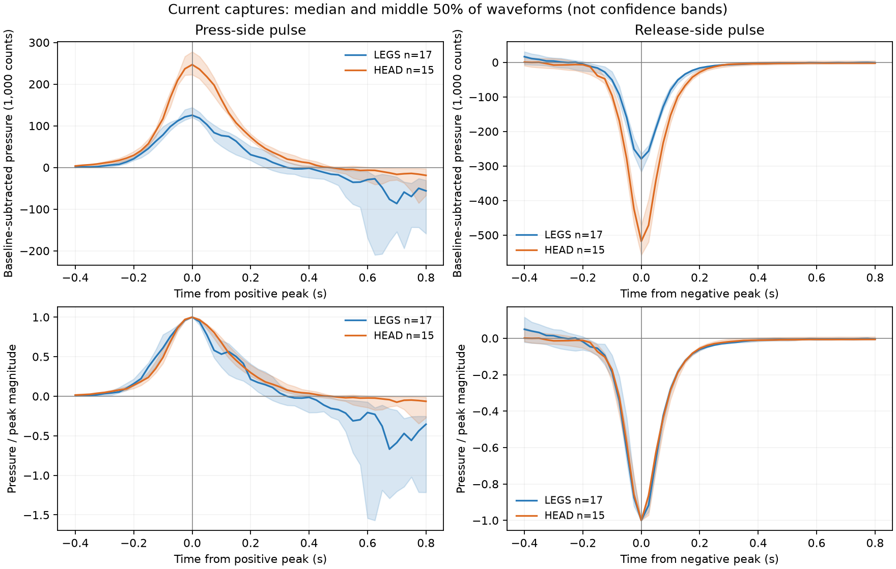
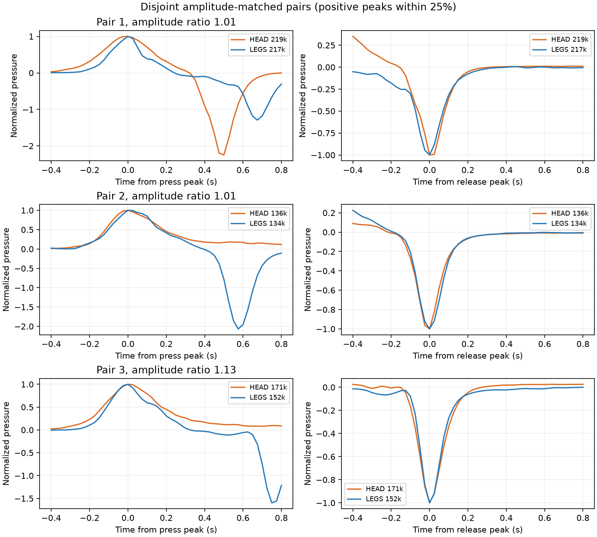
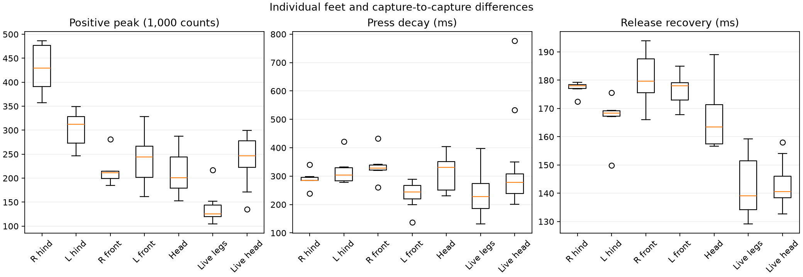

# PneutouchAI — HEADとLEGSの波形を再検証

解析日: 2026-09-20（JST） / Copyright (C) 2026 Kanata the Kid Creator

## 結論

**既存データでは、HEADとLEGSを押し方が変わっても安定して分ける特徴は、まだ確認できない。**
追加記録では振幅がよく分かれたが、最初の7区画記録では大小関係が逆だった。
振幅をそろえると押下・解放波形が重なり、特に解放後の戻り方は両部位でほぼ同じである。
これはユーザーの「HEADとLEGSは半々くらい」という実操作の報告と整合する。
ただし、各誤判定と正解部位を対応づけた記録がないため、個々の誤判定原因まで特定したものではない。

今回分かったことは次のとおり。

- **正圧ピークの大小関係が逆転:** 最初はHEAD 20.1万 < LEGS 27.1万、追加記録はHEAD 24.7万 > LEGS 12.5万counts。
- **当初有望だった面積比の分離が消失:** 最初の記録ではHEADとLEGSの範囲が分かれたが、追加記録では重なる。
- **戻り時間の差は小さい:** 追加記録の負側90→10%回復はHEAD 140.6 ms、LEGS 139.1 ms。
- **小さいLEGSの波形を9件除外していた:** 正圧ピーク10万countsの採用条件による。負側波形は明瞭だった。
- **4本の足を1クラスにまとめる難しさ:** 最初の記録では、頭の押下波形は特に前足と近かった。

40 SPSで大きな波形変化は観測できている。一方、今回のHEAD/LEGSで数msしか違わない指標を
強い識別根拠にはできない。高速化だけで混同が解決するとはいえず、部位に固有の形状差を
確認・設計する必要がある。[隔壁・穴径と空気圧フィルタの検討](pneumatic-filter-design-20260920.md)も参照。

## 作業範囲と保存状態

ユーザー指示に従い、分析の前にGitHub Desktopでcommit/pushを完了した。
実圧力4分類のコミットは `39f8677`、HEAD/LEGS専用モデルは `00d3124`。
GitHub側の恐竜動画5本を取り込んだ `391fd84` が、今回の分析開始時のHEADおよびorigin/mainだった。

本作業は保存CSVのオフライン解析。センサーからの追加取得、モデル再学習、ファームウェアの
書き換えは行っていない。後述の閾値比較はPC用の一時的なCコードで実施した。
現在の実機モデルや採用済み学習データには反映していない。

## 対象データと照合

| 記録群 | HEAD | LEGS | 対象ファイル数 | 生サンプル数 |
|---|---:|---:|---:|---:|
| 最初の7区画計測のうち頭と4本の足 | 7 | 26 | 5 | 10,647 |
| 追加のラベル付き計測のうち頭と足 | 15 | 17 | 3 | 10,871 |
| 合計 | **22** | **43** | **8** | **21,518** |

採用済み65イベントを比較した。別途、追加LEGSの無効9イベントについて除外理由を調べた。
HEADの追加15件は最初の記録2件と補足記録13件からなる。補足13件はユーザーがすべて頭・首と確認済み。
追加LEGSの17件について、右前・左前・右後ろ・左後ろの個別ラベルはない。

現在の `pressure_features.c` をPC上でビルドし、CSVを1点ずつ因果的に再生。
65件すべてについて採用済みデータの12特徴と照合した（rtol=1e-5、atol=0.001）。
基本12特徴・イベント境界・基準値はこのC再生値を使用する。
追加の時定数や整列図はPythonで計算し、正側上昇と負側回復の交差時刻差がC値と0.03 ms以内で一致することを確認した。
この許容差は計算の整合性であり、測定精度ではない。

8本すべて連番欠落0、サンプル間隔中央値25 ms。別ファイル間の未計測区間は接続しない。
記録ごとのSHA-256、点数、再生結果、CソースのSHA-256を
[analysis.json](analysis/2026-09-20-head-legs-detail/analysis.json)に保存した。
ここでの旧記録の数値は現在のC実装による値で、以前のPython解析の丸め値と微差がある。

## どの部分が違うか

### 1. 振幅は大きく違うが、その方向が変わった

すべて直前基準値との差。ADC countsであり、kPaや押す力ではない。

| 指標の中央値 | 最初HEAD | 最初LEGS | 追加HEAD | 追加LEGS |
|---|---:|---:|---:|---:|
| 正圧ピーク（千counts） | 201.2 | 271.3 | 246.8 | 125.4 |
| 負圧の深さ（千counts） | 420.1 | 603.0 | 518.0 | 279.6 |

追加記録だけなら「大きければHEAD」がよく当たる。しかし最初の記録では反対方向になる。
現在の専用モデルは11個の形状特徴に正圧ピークを加えており、この条件差の影響を受ける可能性がある。
今回の再検証により、[前段の専用モデル比較](head-legs-refinement-20260920.md)で見えた改善を
部位に固有の安定した振幅差と解釈できないことが分かった。

力・変位・速度・人形の持ち方を記録していないため、逆転の原因を「力だけ」と断定しない。
部位ごとに別ファイルで計測しており、部位と記録条件の効果を分離できない。

### 2. 基本12特徴の再比較

中央値。正側を押下側、負側を解放側と呼ぶが、指の動作時刻を直接測ったものではない。

| 特徴 | 最初HEAD | 最初LEGS | 追加HEAD | 追加LEGS |
|---|---:|---:|---:|---:|
| 正側10→90%上昇 ms | 225.1 | 169.5 | 170.6 | 181.7 |
| 正側90→10%減衰 ms | 330.9 | 285.3 | 277.6 | 228.5 |
| 正側半値幅 ms | 367.1 | 296.5 | 238.9 | 249.9 |
| 正側面積/ピーク ms | 383.3 | 301.4 | 275.7 | 255.9 |
| 最大上昇傾き/ピーク 1/s | 5.18 | 6.73 | 7.50 | 6.87 |
| 非対称度（減衰/上昇） | 1.281 | 1.673 | 1.588 | 1.214 |
| 負側10→90%進行 ms | 172.7 | 167.4 | 111.0 | 95.5 |
| 負側90→10%回復 ms | 163.4 | 176.5 | 140.6 | 139.1 |
| 負側半値幅 ms | 158.6 | 164.0 | 129.4 | 119.4 |
| 負側面積/深さ ms | 177.6 | 189.0 | 144.6 | 140.4 |
| 負側深さ/正側ピーク | 1.861 | 2.020 | 2.100 | 2.122 |
| 負側面積/正側面積 | 0.912 | 1.271 | 1.081 | 1.168 |

最初はHEADの立ち上がり・正側幅が長かったが、追加記録では差がほぼ消える。
面積比も、最初の「HEADの方が必ず小さい」という観測範囲の分離が崩れた。
正側減衰時間は両記録群ともHEADが約46～49 ms長いが、分布は重なっており、
保持や力の抜き方の影響を含む候補として扱う。



図の数値は **P(HEADの値 > LEGSの値)** という組合せ全体の大小比較（同値は0.5扱い）。
0.5は大小関係がない、1はHEADが常に大きい、0は常に小さいという意味で、分類正解率ではない。
正圧ピークは最初0.231→追加0.973、面積比は0.000→0.420、上昇時間は0.791→0.455。
各指標の四分位範囲・最小最大はJSONと[イベント表](analysis/2026-09-20-head-legs-detail/events.csv)に収録。
単独特徴の重なりは、複数特徴や別モデルによる識別の不可能性を証明するものではない。

### 3. 振幅をそろえると、特に解放後の回復が似ている



上段は基準値を引いた絶対振幅、下段は各イベントの正側ピークまたは負側の深さで割った値。
押下図は正側ピーク、解放図は負側ピークを0秒にして整列した。
線は中央値、帯は中央50%の範囲であり、信頼区間ではない。
正負を別々に正規化すると正負振幅比は消えるため、その比は前節で別に評価している。

追加記録で、負側ピーク後0～350 msの正規化波形のRMS距離を全組合せで比較した。
距離の中央値はHEAD同士0.0378、LEGS同士0.0353、HEAD対LEGS0.0385。
**部位をまたいだ差が、同じ部位を繰り返した差と同程度**だった。
正側ピーク前250～後350 msでは、それぞれ0.1054、0.2001、0.1691。
LEGS内部のばらつきが大きく、単純な波形距離で分けにくい。

距離は振幅比の単位。組合せは同じイベントを何度も共有するため、独立試行の数として数えない。
この整列は完了した波形の形状を見る診断用であり、デモに接触開始時刻を与えたものではない。

### 4. 追加の時定数・戻り後の特徴

| 追加特徴の中央値 | 最初HEAD | 最初LEGS | 追加HEAD | 追加LEGS |
|---|---:|---:|---:|---:|
| 正側90→10%の見かけの指数時定数 ms | 161.8 | 148.0 | 126.1 | 123.1 |
| 負側90→10%の見かけの指数時定数 ms | 71.8 | 76.5 | 61.4 | 60.0 |
| 負側ピーク後400～700 msの中央値/負側深さ | −0.007 | −0.011 | −0.007 | −0.007 |

指数近似は片側減衰区間の形状を表す。空気回路の抵抗・容量から同定したRC時定数ではない。
追加記録の正側時定数差は約3 ms、負側回復時間差は約1.5 msで、強い分離はない。
負側ピーク後200～800 msの最大戻り値も、大小比較は最初0.467、追加0.447で分離に乏しい。
戻った後の肩・残留値に強い安定特徴があるとは確認できなかった。
これらの追加窓には、現行のイベント完了時刻より後のデータが入る場合があり、
そのままファームウェアに追加すれば観測待ち時間が増える可能性がある。

### 5. 正負の間隔は違うが、部位への伝達遅延とは呼べない

追加記録の正側ピーク→負側ピーク間隔はHEAD 1,033 ms、LEGS 705 ms。
正側10%開始→負側10%開始ならHEAD 1,106.7 ms、LEGS 819.7 msだった。
後者の四分位範囲はHEAD 922.6～1,194.3 ms、LEGS 688.1～921.3 ms。
最初の記録の同じ中央値はHEAD 855.1 ms、LEGS 763.4 msである。

波形間隔は比較的分かれるが、手が握ってから離すまでの動作を含む。
「約1秒」という指示は実測した保持時間の統一を意味しない。
これを主特徴にすると部位より操作リズムを覚える危険がある。
接触時刻が未知でも波形間隔は計算できるが、使えることと部位に固有であることは別問題。
指の接触時刻を測っていないので、経路の長さによる到達遅延の検証にはならない。

### 6. 同程度の振幅でも形状差は一定ではない



正側ピークの比が1/1.25～1.25の範囲で、対数振幅差の小さい組から重複なく対応づけると3組できた。
比は1.011、1.013、1.129。第1組の正負ピーク間隔はHEADの方が202 ms短いが、
第2・3組ではHEADが529 ms、504 ms長い。負側回復差も−26.0、+16.8、+5.8 msと一定でない。
第2組は初期の正側パルスが近く、後ろの肩と正負間隔が違う。
3組のみの探索で、操作条件を統制した比較ではない。振幅一致は力や押し込み量の一致ではない。

### 7. LEGSは4本の異なる足をまとめたクラス



| 最初の記録 | n | 正圧ピーク 千counts | 上昇 ms | 正側減衰 ms | 負側回復 ms |
|---|---:|---:|---:|---:|---:|
| 右後ろ足 | 6 | 429.7 | 149.2 | 285.3 | 178.0 |
| 左後ろ足 | 6 | 312.4 | 134.3 | 303.9 | 168.4 |
| 右前足 | 6 | 211.7 | 195.7 | 328.1 | 179.7 |
| 左前足 | 8 | 244.2 | 215.7 | 244.2 | 178.0 |
| 首と頭 | 7 | 201.2 | 225.1 | 330.9 | 163.4 |

頭は特に前足と正側振幅・上昇時間が近い。LEGSの平均的な1つの形だけを学ぶと、
前足型と後ろ足型の広がりを表現しきれない可能性がある。
表示をLEGSの1種類に保ちつつ、学習用には4本の位置ラベルを保持する価値がある。
今回の追加LEGSは足の内訳が不明なため、特定の足が誤判定を起こしたとは断定できない。

## 小さいLEGS波形9件が採用条件から落ちた

検出器は基準＋50,000 countsを2点連続で超えると候補を開始する。
負側を経て基準付近へ8点戻った後、特徴抽出の入口で
「正側ピーク100,000以上、負側深さ30,000以上」を要求する。

追加LEGSでは候補26件すべてが正負ペアとして解決したが、17件が有効、9件が無効。
Cコードの実際の棄却分岐をPC上で記録し、9件すべてが正側振幅不足と確認した。
正側は65,816.5～96,952 counts、負側は199,831～372,390 countsだった。
無効IDは2、7、8、9、11、14、15、17、18。全数値はJSONに保存した。

**17/26は解決済み候補の採用率であり、実際の全押下に対する検出率ではない。**
人が何回押したかの独立した全数記録はない。トリガーに届かなかった接触も評価できない。

正側の採用閾値だけを変え、保存8本を再生した結果:

| 正側採用閾値 counts | 追加LEGS有効 | 追加LEGS無効 | 元の17件に加わる数 |
|---|---:|---:|---:|
| 100,000（現行） | 17 | 9 | 0 |
| 90,000 | 18 | 8 | 1 |
| 75,000 | 24 | 2 | 7 |
| 50,000 | 26 | 0 | 9 |

残る7記録の採用結果は不変。元の有効65件の特徴値は完全一致し、
全候補の開始・終了・IDも同一だった。トリガー条件自体は変更していない。
低閾値で新たに有効になった波形も12特徴すべてを計算できた。
追加9件の特徴は感度分析JSONにのみ保存し、学習データへ自動追加していない。

学習から小さい波形が抜ける偏りは確認できた。ただし、閾値を下げてもHEAD/LEGSの
分類が改善するとはまだいえない。低圧力の採用率と部位分類精度は別の指標である。
静止・持ち上げ・机への接触などに対する誤採用を確認してから、採用条件の変更を判断する。

## 今後どの特徴を優先するか

| 候補 | 今回の判断 |
|---|---|
| 絶対ピーク | 記録内では強いが、記録間で逆転。主な判断根拠に依存しすぎない |
| 正側減衰・正側等価幅 | HEADが長い傾向は両記録群に残る。形状の補助候補だが重なりと操作依存がある |
| 負/正ピーク比 | 同方向の弱い差は残る。単独の境界には不十分 |
| 負/正面積比 | 最初の明瞭な分離が追加記録で消えた。固定閾値を採用しない |
| 解放後の回復・指数時定数・残留値 | HEAD/LEGSでは差が小さく、追加する根拠が弱い |
| 正負の時間間隔 | 見かけ上は有用だが、操作リズムとの交絡が大きい |
| 波形全体 | 肩など12特徴が落とす情報を保てるが、入力条件の偏りや波形の重なりは自動で解決しない |

まず小振幅イベントを含めたデータの扱いを整理し、最初・追加の両記録群で成立する候補を比較する。
これらを今から混ぜて学習した場合、両方とも学習済みとなり、新しい独立テストには使えない。
開発用の比較と明示した上で、将来は記録全体を分けた評価が必要である。

機械構造を変えるなら、幅や減衰などに押し方のばらつきを上回る差を作る方向が有望。
現行データだけで推奨穴径を確定したり、AIの種類・入力数だけで解決すると判断したりしない。
接触開始を未知とする要件は維持する。

## 再現方法と限界

```powershell
$env:CC='C:/path/to/zig.exe cc'
.venv/Scripts/python.exe tools/analyze_head_legs_detail.py
```

C11コンパイラと既存のPython環境（NumPy、Matplotlib）が必要。
一時的なホストCソース・実行ファイルは `build/`、結果は
`docs/analysis/2026-09-20-head-legs-detail/` に生成する。シリアルポートは開かない。

- `analysis.json`: 全65イベント、記録ハッシュ、分布、棄却理由、閾値感度、波形距離、振幅対応。
- `events.csv`: 採用済み65イベントの12特徴と追加指標。
- `aligned-waveforms.csv`: 各ピーク基準の25 ms格子、基準差分と正規化値。
- 4枚のPNG: 位相別波形、大小比較、足別分布、振幅を合わせた3組。

65件は同じ日・同じ人・同じ恐竜の繰り返しであり、65個の独立した使用条件ではない。
多数の特徴を同じデータで調べた探索なので、狭い信頼区間や有意差を示さない。
新しい正解付き実押下の精度を測った結果ではない。
今回追加された動画5本はUARTとの同期が記録されておらず、個々のイベントの正解や接触時刻に流用しない。
単一出力と未知の手入力から、穴の抵抗・TPUの変形・漏れ・計測系の応答を個別に同定することはできない。
