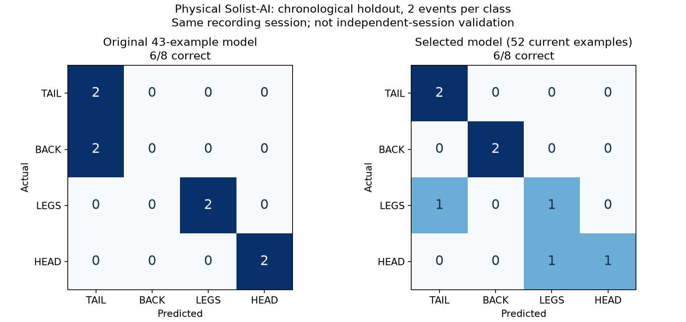

# PneutouchAI — 実センサーによる4分類デモ

Copyright (C) 2026 Kanata the Kid Creator

現行版はHEAD/LEGS専用モデルを追加した2段階判別。
変更理由、比較結果、実機検証は[頭と足の判別改善](head-legs-refinement-20260920.md)を参照。

## 操作

1. `PneutouchAi (in pneutouch-solist)` を **Debug** でビルド。
2. **PneutouchAi Write** をDebug起動して書き込む。
3. 電源投入後、LCDの `READY` を確認し、初期基準圧が安定するまで約2秒は触らない。
4. 頭・背中・足・しっぽのいずれかを約1秒押して離す。
5. 解放後の圧力変化から推定し、`HEAD / BACK / LEGS / TAIL` を3秒表示する。

4本の足はすべて `LEGS`、首と頭は `HEAD`。開始時刻や部位をPCで指定する必要はない。
表示中も40 SPSの取得・次イベント検出は続く。新結果で表示を上書きし、3秒を数え直す。
結果がない間は `READY`。起動時の学習が失敗した場合は `AI ERROR`。
LCDのI2C異常はUARTに通知し、センサー取得は続ける。

## 実装

`main.c` → `pressure_app.c` → HX710B実読取 → `pressure_features.c` →
`pressure_model.c` → Solist-AI → `pressure_display.c` → LCD。

推定にはその場の実センサーのデータのみを使い、保存波形を自動再生しない。
イベント開始は50,000 counts超の2点連続で判定。押下後の負圧と基準への回復を確認して
12特徴を確定する。未完了、ADC飽和、欠番、時間切れのイベントは分類しない。
操作を始めた瞬間の判定ではなく、解放の形まで観察した後の判定である。

12特徴は立ち上がり、減衰、半値幅、面積幅、正規化傾き、非対称度、
解放側立ち上がり、回復、解放側半値幅・面積幅、負正ピーク比、負正面積比。
各値に自然対数を取り、固定平均と標準偏差の3倍で正規化し、float32上位16bitをbfloat16として渡す。
推定時の教師入力は全0であり、触れた場所のラベルは渡さない。
通常モデルがHEADまたはLEGSを返した場合は、チップ内の別インスタンスで判別し直す。
専用モデルも12入力だが、非対称度を正圧ピーク（基準差圧、1000 ADC counts単位）に置き換える。
TAIL/BACKの結果はそのまま使う。`PNEF1`は従来の形状12特徴のログを維持する。

## 学習モデル

追加計測した60イベントの12特徴と正解部位をFLASHへ格納し、電源投入時にチップ上で学習する。
モデル設定は12入力、隠れ32、4出力、hard sigmoid、MSE、seed=1、4エポック。
`ODL_Initialize/Reset` 後にBeta=0、P=単位行列を明示的に設定する。
学習順もFLASHに固定。通常モデルは240ステップ、同じ60件に含まれる頭15件・足17件で
専用モデルを128ステップ学習し、合計368ステップ。両モデルとも12入力・隠れ32・4出力で、
専用モデルは出力3/4だけを比較する。PCやFeRAMへのモデル保存に依存しない。

この60件全体での学習はデモ用の最終学習であり、新たな未知データでの精度評価ではない。
既存の分割評価21/22・19/22とは区別する。通常モデルは4出力の最大値を選ぶ方式で、
未知の部位・握り方の拒否や確率校正は未実装。

再生成: `python tools/generate_pressure_model.py`。
現行モデルの入力は `analysis/2026-09-20-live-calibration/pressure-demo-training.json`。
以前の43件は `analysis/2026-09-20-pressure/results/solist-inputs.json` に保存して比較用に保持する。
PAI1の比較実験から復帰した際も通常モデルを再学習する。

## UART・デバッグ

CN9はCOM6/COM7、圧力UARTは **COM7, 115200/8N1**。MCU-LINKはCOM4/COM5。

| 出力 | 意味 |
|---|---|
| `PNEU1,seq,ms,raw` | 実センサー生値 |
| `# PNEE1` / `# PNEF1` | 検出イベントと12特徴 |
| `# PNEM1,READY,60,368,us` | 両モデルの起動時学習完了 |
| `# PNEM2,HEAD_LEGS,32,128,input5=positive_peak_kcounts` | 専用モデルの構成（input5は0始まり） |
| `# PNEC1,id,ms,label,us,s0,s1,s2,s3` | 最終段のスコア。bfloat16の16進数、順序TAIL/BACK/LEGS/HEAD。専用段はLEGS/HEADだけを比較。usは前処理と全推定を含む |
| `# PNEL1,label,ms` | LCDへの全文送信ACKの時刻。UNKNOWNは待機表示への復帰 |
| `# PNEL1,ERROR,I2C` | LCD通信異常 |

`pneutouch_model` と `pneutouch_display` に入力・出力・時間・状態を保存する。
`tools/monitor_live_demo.py` は受信専用。センサー入力・教師ラベル・操作指示をMCUへ送らない。

LCDは既存コマンド列で初期化し、I2C割り込みで送信する。
3秒は結果文字列の全文ACKから計り、3000ms経過で待機文字列への更新を開始する。
LCD未接続・バス異常でループを止めないよう、転送を10msで打ち切る。

## 検証記録

ホストテスト: 実ドライバーのGPIO入力から特徴抽出・分類呼出し・LCD要求までの連携、
368回の学習と教師入力、前処理、4クラスの選択、異常入力、AIタイムアウトを確認。
LCDは4種類の文字列、3秒の保持、上書き、時計の桁あふれ、I2C異常を確認。
初回ライブ版をDebugでビルド・書き込み。エラー0、既存未使用UARTコマンドコードの
ポインター符号警告6件。起動時学習223,154µs、実イベントの推定103〜106µs。
受信専用モニターで5710サンプル、欠番0、LCD待機復帰5回がすべて3001msを確認した。
ただし特徴抽出完了時に最大46msの計算待ちがあり、サンプル間隔7〜51msが混在したため、
時刻・差圧の繰り返し計算をキャッシュする改善を最終版に追加した。これは最終版の検証値ではない。

### 初回ライブ試験で見つかった誤分類

ユーザー申告は「頭3回、その後背中2回」。ファームウェアは6イベントを検出し、すべてTAIL。
正しい分類を確認できたとは扱わない。6イベントと5操作の対応は未確定で、この一括記録を
正解ラベル付き学習データには追加しない。

実機メモリで最後の12入力値を確認し、PCの正規化値をbfloat16化した値と一致した。
同じ最終学習をPAI1経由でチップ上に再構築すると、元の43件は42件を正しく再現し、
新しい6件は同じスコアですべてTAILとなった。入力・学習経路の取り違えは再現しなかった。
この42/43は学習データ自身の再現性チェックであり、未知データ精度ではない。

新しい6件の正圧減衰は54〜70msで、学習時クラス中央値196〜331msより短い。
解放立ち上がりや非対称度も分布外となり、モデルの押し方への頑健性不足が見つかった。
続いてユーザーの開始・終了に合わせて4部位を追加計測し、ラベルが確かなデータで再学習した。
資料: `analysis/2026-09-20-pressure/results/live-model-diagnosis.json` と
`analysis/2026-09-20-live-calibration/`。

### 追加計測とモデル比較

| 部位 | 学習候補として採用した完全な波形 | CSVのサンプル数 |
|---|---:|---:|
| HEAD | 15 | 2441 + 3817 |
| BACK | 12 | 4719 |
| LEGS | 17 | 4613 |
| TAIL | 16 | 4705 |

合計60波形。受信の欠番は各CSVとも0。開始境界にかかった波形や特徴確定できない波形は除外し、
保存CSVのC再生と実機が送った12特徴が一致するものだけを採用した。
足の記録では9件のINVALIDも発生した。実操作数を別計数していないため、
上の60件だけから「全押下の検出率」は算出できない。

各部位の最後の2件、計8件を最後の確認まで保留。
その前の各2件、計8件をモデル選択に使い、残りで学習した。
seed=1、4エポック、前処理と12特徴は固定し、実チップで次を比較した。

| 隠れ層 | 学習に使う記録 | 選択用8件の正解 |
|---:|---|---:|
| 32 | 元の43件 + 今回の追加計測 | 6/8 |
| **32** | **今回の追加計測のみ** | **7/8（採用）** |
| 64 | 元の43件 + 今回の追加計測 | 7/8 |
| 64 | 今回の追加計測のみ | 6/8 |

同点では小さいモデルを先に選ぶ事前の順序に従った。
選択後は今回の52件で学習し直し、最後まで保留していた8件に対し **6/8 = 75%**。
TAIL 2/2、BACK 2/2、LEGS 1/2、HEAD 1/2で、足→しっぽ、頭→足の誤りが各1件。
旧モデルも同じ8件では6/8だが、背中2件をしっぽに誤判定していた。
総正解率が改善したとは結論しない。別日・別操作からなる独立評価でもない。

最後に、表示するデモ用モデルは今回の60件すべてで再学習する設定としてFLASHへ組み込む。
この最終モデルは確認用8件も学習に含むため、上記75%は52件で学習した評価モデルの値である。
原データ、分割インデックス、全スコア、モデル選択過程を
`pressure-demo-inputs.json` / `model-selection.json` / `pressure-demo-training.json` に保存した。

再実行は `prepare_live_calibration.py` → `validate_live_model.py` → `generate_pressure_model.py`。
特徴抽出の処理負荷を減らすため時刻と差圧を一度だけ計算し、キャッシュを使うよう修正。
修正前後のC再生出力は、旧8記録と追加5記録のすべてで文字列まで一致した。

### 単段モデル（39f8677）の書き込みと動作確認

60件・240ステップのモデルと特徴抽出のキャッシュを含む最終版を、Debugでビルドし、
`PneutouchAi Write` のDebug設定で実機に書き込んだ。ビルドはエラー0、
既存の未使用UARTコマンドコードにポインター符号警告6件。
ホスト検証はC 7スイート、Python 22件中21件成功・1件環境依存スキップ、JavaScript 7件成功。
通常RAMの予約量はスタックを含め8,496 / 16,384 bytes。ビルドのハッシュと詳細は
`analysis/2026-09-20-live-calibration/final-build.json` に保存した。

起動ログは `# PNEM1,READY,60,240,311069`。チップ上の自動学習は約311msで完了し、
LCD初期化と待機文字列の送信ACKを確認した。書き込み前から受信を待った120秒のモニターでは、
起動後の2,106サンプルを記録し、欠番0、サンプル間隔は25msまたは26msだった。
この最終モニターでは押下イベントがなく、改善後のイベント特徴抽出の最大計算時間と
新モデルの実押下分類・LCD保持時間は再測定していない。
3秒保持の実機値は上記の初回ライブ版、最終版の同じ表示ロジックはホストテストで確認した。

追加の実チップチェックでは最終モデルと同じ60件・設定で学習し、同じ60件を推定した。
再現は **46/60**、内訳はTAIL 16/16、BACK 11/12、LEGS 6/17、HEAD 13/15。
足17件のうち8件が頭、2件がしっぽ、1件が背中に誤分類された。
これは学習済みデータ自身の再現であり、未知データ精度ではない。学習済みでも足の区別は弱く、
現在の12特徴・モデル設定で安定した4分類を達成したとはいえない。
確認後は検証モードを終了し、通常モデルの再学習、待機表示、実センサー127サンプルの受信を確認した。
記録は `deployment-fit-check.json` / `deployment-fit-check.uart.log` / `deployment-resume.json`。

次の改善候補は、足の無効イベントの原因と部位間で重なる特徴の調査、
押す強さ・持ち方のばらつきを含めたデータでのモデル比較である。
この確認結果を見て設定を再選択すると評価に偏りが入るため、今回は設定を変更せず、
改善版の評価には別途保留した新しい記録を使う必要がある。

書き込み後のユーザー確認では「HEADだけはずっとLEGSになる、ほかはおおむねOK」との報告があった。
この報告に対応する操作ごとのUART記録・正解対応は保存できていないため、正解率には換算しない。
HEADとLEGSの混同を次の優先課題とする。

## 表記確認

現行 `src/pneutouch-solist` 内のソース、隠し設定、launch、Tcl、ファイル名を確認した。
タイトルと制作者をPneutouchAI / Kanata the Kid Creatorに変更し、旧表記を削除。
未使用の旧名Tclを削除し、`.cproject` の内部IDも現行名に統一。
参考資料索引・調査記録・SDK検索用の外部配布物パスには、資料を特定する正式名称が残る。
