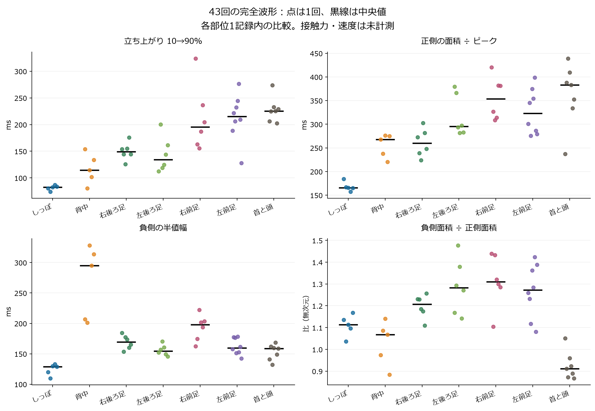
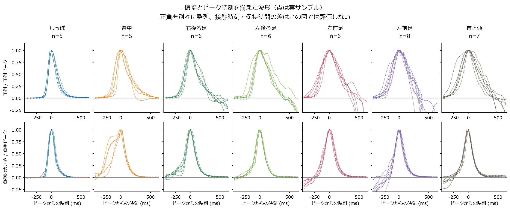
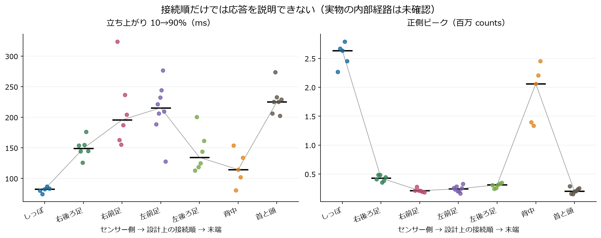
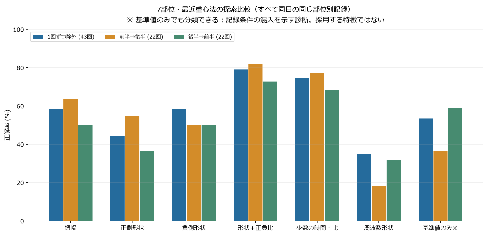
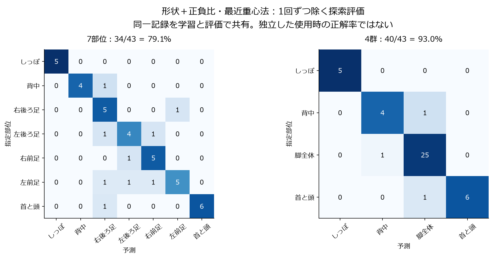
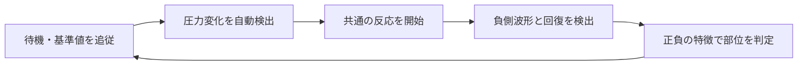
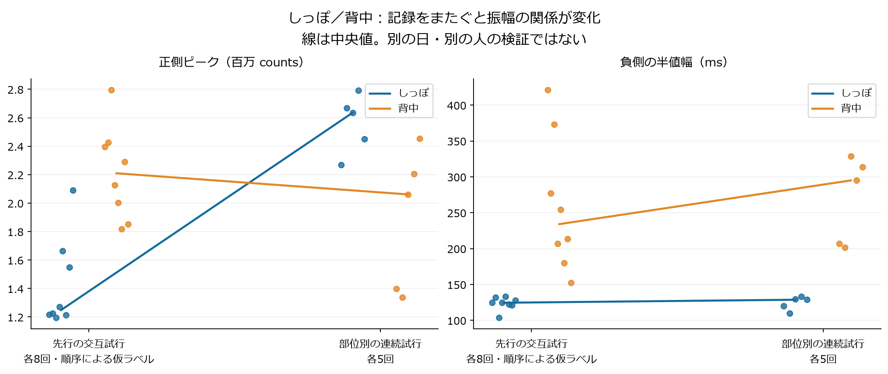

# 恐竜7区画・40 SPS実測の特徴検証

解析日: 2026-09-20（JST）。対象: MPS20N0040D＋HX710B、完成した恐竜1体、同日の1人による操作。
本書は保存済みCSVのオフライン解析であり、実機への分類器の実装・書き込みは行っていない。

## 1. 結論と判断

**40 SPSでも、部位による立ち上がり・幅・正負の面積比の違いを観測できた。当初想定した「過渡波形で位置を見分ける」方向には根拠がある。ただし、7区画が未知の押し方でも安定して分類できることや、差の原因が内部の絞り・空気経路であることは、まだ実証していない。**

- しっぽは短く鋭い正側波形、背中は広い負側波形、首と頭は比較的小さい「負側面積÷正側面積」が特徴候補になった。脚同士の特徴には重なりがある。
- 振幅だけより、**正側形状＋負側形状＋正負の比**の組合せが有望。今回の探索評価は7部位で34/43回、4群（しっぽ・背中・脚全体・首と頭）で40/43回正解だった。ただし同じ記録を学習と評価で共有した値であり、実用上の正解率ではない。
- 先行するしっぽ／背中の交互試行との比較では、振幅の大小関係が変わった。一方、負側の形状は比較的保たれた。**離した時の情報を使う価値がある**。交互試行の部位ラベルは申告された順番から付けた仮ラベルなので、独立した正解確認が必要。
- **遠い区画ほど単純に遅い、という説明は成立しない。** 接触時刻を独立に記録していないため、触れてからセンサーに届くまでの遅延は測れていない。
- 次は40 SPSを維持し、強さ・速度・保持時間を揃える試験と、部位を混ぜた順序での追加収集を優先する。4群を先に評価しつつ、7部位のラベルは保持する。高速ADCへの変更を、このデータだけで必須とも不要とも断定しない。

**デモでは接触開始が未知であることを前提とする。** 外部から接触時刻を与える処理は必要条件にしない。この条件に合わせた逐次再生でも、7部位の完全波形43回と先行交互試行16回を圧力だけで検出できた。検出後0.8秒の暫定判定と、解放・回復まで待つ判定の違いは第7節に記す。実際の指の接触時刻を別途測る提案は、応答遅延を評価するための計測用であり、デモ動作の入力ではない。

## 2. 当初の狙いとの照合

判断基準は[元の構想](concept.md)、[製品設計](product-design.md)、[実装プランM2～M4](implementation-plan.md)、[センサー検討](sensor-options.md)にある。構想内の例示スコアや図は、今回の実測値とは区別した。

| 元の狙い・検証項目 | 今回の判定 | 根拠と残る課題 |
|---|---|---|
| 1個のセンサーで7区画すべての変化を受信 | 確認 | 全区画で繰り返しの正負波形を取得。指定部位に対応する記録として扱う |
| 立ち上がり・ピークまでの時間に部位差 | 一部確認 | 立ち上がり中央値82～225 ms。ただし手の速度を含み、接触からの到達時間ではない |
| 面積・減衰・解放後の戻り方に部位差 | 確認した特徴候補 | 正規化面積、負側の幅、正負面積比に差。脚同士は重なる |
| 内部容積・絞り・経路が位置を符号化 | 未確定 | 全体の応答に差はあるが、構造・手の操作・材料・計測系の寄与を分離していない |
| センサーからの経路順で単純に遅くなる | 支持しない | 経路終盤の背中が、途中の前足より速い。原案の複合的な符号化まで否定する結果ではない |
| 正規化すれば押す強さに頑健 | 未確定 | 数学的な一様倍率は消せるが、強さに伴う形状変化は消せない。強弱試験が必要 |
| 保持中の圧力や漏れを評価 | 未確定・要試験 | 正側が戻ってから負側が出る例がある。保持変位・力が不明で漏れと断定できない |
| 40 SPSで分類に有用な特徴を得る | 探索段階では支持 | 数サンプル以上にまたがる形状差を取得。数msの差や高速帯域は未評価 |
| 7部位を安定識別 | 未達 | 5～8回/部位、各部位1記録。独立した記録・日・人での評価がない |

## 3. データと品質

7部位を順に指定し、「開始」で受信を開始、「終了」で停止した。目標は静止3秒、約1秒押す→約3秒離すを5回、最後に静止3秒。これは操作指示であり、実測した接触時間ではない。左右は恐竜自身から見た左右。「首と頭」は今回1クラスとして扱う。

| 区画 | 指定部位 | ファイル時刻（JST） | CSV点数 | 記録長 s | 完全波形 | 除外 |
|---|---|---|---:|---:|---:|---|
| 1 | しっぽ | 17:12:35 | 1,561 | 39.278 | 5 | 0 |
| 2 | 背中 | 17:15:56 | 2,024 | 50.931 | 5 | 開始端にかかった1波形 |
| 3 | 右後ろ足 | 17:18:39 | 2,094 | 52.697 | 6 | 0 |
| 4 | 左後ろ足 | 17:20:18 | 2,203 | 55.436 | 6 | 0 |
| 5 | 右前足 | 17:38:26 | 2,095 | 52.707 | 6 | 0 |
| 6 | 左前足 | 17:40:28 | 2,275 | 57.248 | 8 | 0 |
| 7 | 首と頭 | 17:42:26 | 1,980 | 49.834 | 7 | 0 |
| 合計 | 7区画 | — | **14,232** | **358.131** | **43** | **1** |

目標5回を超えた波形は捨てずに採用し、各部位先頭5回だけの評価も併記した。左後ろ足の終了メッセージの受信カウンターとCSV行数には1点の差があったが、停止直前に保存された行も連番が連続しており、CSV実体の2,203点を採用した。

全7記録で、実効39.7118～39.7291 SPS、MCU時刻差は25または26 ms、連番欠落0、符号付き24 bit ADCの上下端一致0。各ファイルは連続しているが、**別ファイル間の未計測時間を連続データとして補完・接続していない**。

正側ピーク÷直前基準区間の標準偏差は、完全波形の最小でも約56倍。今回の操作波形は直前のばらつきから十分大きい。ただし、これは装置の規格としてのS/Nや、より弱い接触の検出率ではない。上下端一致0も、センサー・増幅器を含めた全段の無飽和を保証するものではない。

追加比較に16:42:29開始のしっぽ／背中の交互記録を用いた。3,930点、98.908秒、欠番0、16完全波形。申告された「しっぽから交互」の順番に基づく各8回の**仮ラベル**であり、同期した部位・接触の正解記録はない。7区画43回のモデル評価には混ぜず、別記録への適用の参考検査にのみ使った。

元CSV8本、用途・ラベル根拠・SHA-256は[解析データのmanifest](analysis/2026-09-20-pressure/manifest.json)に保存。CSVの生値・空のラベル列は変更せず、イベントのラベルは別表に持たせた。

## 4. 波形の切り出しと特徴の定義

### 全部位で同じ検出条件

記録全体の中央値より50,000 counts上を候補とし、0.4秒未満の肩の分裂を結合。ピークが中央値より100,000 counts以上、しきい値超えが2点以上の候補を残した。候補数を5回に合わせる処理はない。候補検出のしきい値を30,000 / 50,000 / 75,000 / 100,000へ変更しても、今回8記録の候補数は変わらなかった。ただしこれは**候補数の感度検査**であり、全特徴・モデル成績が不変という意味ではない。

各候補のしきい値通過0.8～0.3秒前の中央値を、その回の基準値bとする。基準区間が5点未満、記録端、正負の交差点不足は除外。7区画では背中の開始端1回だけを除外し、43回の完全な正負波形を解析した。完全な波形に限定したため、未検出・不完全な操作を含むオンライン検出率は評価していない。

以前の部位別速報は弱い波形に合わせて検出しきい値を変えていた。本解析は共通条件と統一した特徴定義で生CSVから再計算したため、速報の基準値・幅等とは小さな差がある。本書の値は本書と一緒に保存した解析結果を正とする。

### countsと時間の読み方

`z(t) = raw(t) − b`、正側の最大値をA、負側の深さをB（正の数）とする。正負は**直前基準値からの増減**であり、校正したkPaや絶対圧の正負を意味しない。操作説明から正側を押下側、負側を解放側と呼ぶが、各回の指の接触・離脱は独立に計測していない。

| 特徴・出力列 | 定義 | 用途と制約 |
|---|---|---|
| `peak_counts`, `trough_counts` | A、B | 大きさ。力・変位・容積の影響を受ける |
| `rise_ms` | 正側10%→90% | 波形の立ち上がり時間 |
| `peak_from_wave_onset_ms` | 正側10%から観測ピークまで | **接触開始からの遅延ではない** |
| `decay_ms` | 正側90%→10% | 正側の戻り |
| `width_ms` | 正側50%の上り→下り | 正側半値幅 |
| `area_counts_s`, `area_width_ms` | 正側10%上り→10%下りの積分、積分÷A | 面積と等価幅。後者の単位はms |
| `slope_norm_s`, `asymmetry` | 上りの最大隣接傾き÷A、減衰時間÷上昇時間 | 鋭さと非対称性。傾きはサンプル位相・ノイズに敏感 |
| `release_rise_ms`, `recovery_ms` | 負側の深さ10%→90%、90%→10% | 負側の進み方・回復時間 |
| `release_width_ms`, `release_area_width_ms` | 負側半値幅、負側10%間の面積÷B | 負側の幅。解放速度の影響は残る |
| `trough_peak_ratio`, `area_ratio` | B÷A、負側面積÷正側面積 | 正負の釣合い。一様な振幅倍率を除ける |
| `apparent_decay_tau_ms` | 正側90%→10%を指数減衰に近似した見かけの時定数 | 物理的な空気回路のRC値と同定したものではない |

交差時刻は隣接2サンプル間の線形補間。小数のms表示は計算上の補間値であり、25 ms未満の計測精度を保証しない。面積は交差点を端に加えた台形積分。追加の平滑化フィルターはかけていない。

イベント一覧は[events.csv](analysis/2026-09-20-pressure/results/events.csv)、中央値・四分位・最小最大は[zone-statistics.csv](analysis/2026-09-20-pressure/results/zone-statistics.csv)。

## 5. 部位ごとに何が違ったか

数値は完全波形の中央値。表の単位と正負の定義は前節に従う。

| 部位 | n | A（千counts） | 上昇 ms | 正側減衰 ms | 正側面積/A ms | 負側半値幅 ms | B/A | 負/正 面積比 |
|---|---:|---:|---:|---:|---:|---:|---:|---:|
| しっぽ | 5 | 2,635.6 | 82.4 | 196.3 | 166.0 | 128.7 | 1.37 | 1.11 |
| 背中 | 5 | 2,061.0 | 114.4 | 307.1 | 268.1 | 295.0 | 0.99 | 1.07 |
| 右後ろ足 | 6 | 429.7 | 149.2 | 285.3 | 260.2 | 169.4 | 1.55 | 1.21 |
| 左後ろ足 | 6 | 312.4 | 134.3 | 303.9 | 295.5 | 154.4 | 2.25 | 1.28 |
| 右前足 | 6 | 211.7 | 195.7 | 328.1 | 353.8 | 197.8 | 2.10 | 1.31 |
| 左前足 | 8 | 244.1 | 215.4 | 244.2 | 322.8 | 159.6 | 2.25 | 1.27 |
| 首と頭 | 7 | 201.2 | 225.1 | 330.8 | 383.3 | 158.6 | 1.86 | 0.91 |



**しっぽ:** 上昇時間74.3～87.0 ms、正側半値幅144.2～170.3 ms。今回の5回は鋭い形がよく揃った。背中の上昇時間80.5～154.0 msとは一部重なり、上昇時間1個だけで完全分離はできない。

**背中:** 負側半値幅201.4～328.4 ms。しっぽ109.7～132.8 msより明確に広い。負側の立ち上がりに肩があり、負側を単純な左右対称の山と扱わない方がよい。右前足162.6～222.1 msとは一部重なる。

**右後ろ足:** 正側面積/Aの中央値260.2 msは背中268.1 msに近いが、負側半値幅169.4 msは背中295.0 msより短い。押した時だけでなく離した時を合わせる理由になる。

**左後ろ足と左前足:** B/Aはともに約2.25、負側半値幅も154～160 msと近い。上昇時間・正側幅を組み合わせる余地はあるが、回ごとの重なりが大きく、安定識別を確認したとは言えない。

**右前足:** 正側は広め、負側半値幅は脚の中では長め。ただし上昇時間155.5～323.8 msとばらつき、固定しきい値1本の識別には向かない。

**首と頭:** 上昇時間202.3～274.0 ms、負/正面積比0.867～1.051。今回の脚の面積比は1.080～1.477で、観測範囲は重ならなかった。ただし最も近い境界の余裕は約0.029しかなく、この43回から1.06等の固定しきい値を採用してはいけない。基準値誤差・押す強さ・速度を変えた再検証が必要。背中・しっぽとは面積比だけでは重なる。



正負を別々のピークで揃えた図でも形状差は残った。ただし、この図の整列は波形全体を見た後の処理である。見た目が揃うことは即時分類の成立を意味しない。

### 設計上の経路順との関係

設計資料の順序は、センサー→**1しっぽ→3右後ろ足→5右前足→6左前足→4左後ろ足→2背中→7首と頭**。この順の上昇時間中央値は82→149→196→215→134→114→225 ms。途中で短くなるため単調ではない。7中央値の経路順位とのSpearman相関は、上昇時間0.43、正側半値幅0.64、見かけの時定数0.25。小標本の記述値であり、有意差や因果関係の検定結果ではない。



穴の数・経路距離だけから部位を逆算する方法は、この結果では裏付けられない。ユーザーの「しっぽは少ししか押せず、背中は大きく押し込めた」という感覚は、入力変位・有効容積・材料変形が異なる可能性を示す。実物の容積・穴・閉塞・漏れ・力・変位を測っていないため、どれが支配的かは未確定。

### 減衰と保持の読み直し

正側90→10%の指数近似は、部位別のlog空間R²中央値0.922～0.996で、部分区間は指数状に見える。見かけの時定数中央値は、しっぽ85.6 ms、その他137.7～163.1 ms。しっぽ以外の重なりが多く、単一の時定数だけで7区画を説明する根拠は弱い。手の荷重変化、TPUの変形、空気経路、取得系をまとめた観測値である。

正側がピークの10%まで戻ってから負側が始まるまでに、評価可能な間隔がある例は17/43回。しっぽ5回ではその間の値の中央値が正側ピークの約1.1%、背中5回では約−0.6%まで戻っていた。**「約1秒押す」という指示中ずっと高い圧力が維持された、とまでは言えない。** 漏れ、変形の緩和、手の力の抜け、計測系などを切り分ける保持試験が必要で、今回だけで漏れとは断定しない。

正側10%上昇から負側10%開始までの間隔も、しっぽ中央値1.12秒に対して左前足0.65秒と違う。これは保持時間の代理値にすぎないが、操作条件の不揃いを示唆する。**この間隔、部位順、ファイル名、前後の待ち時間は分類特徴に入れていない。** 形状自体に操作の影響が残る可能性はある。

## 6. どの特徴の組合せが使えるか

### 評価方法と読み方

分類器は最近重心法と1近傍法。スカラー特徴は対数を取り、**学習側だけ**で平均・標準偏差を計算して標準化する。波形ベクトルは自身の窓内の最大絶対値で正規化し、学習全体の標準化は行わない。分類器・特徴群を複数比較した探索であり、ここから選んだ方法には新しい試験データが必要。[前処理の学習・評価分離の根拠](https://scikit-learn.org/stable/common_pitfalls.html)

| 分割 | 学習と評価 | 何が分かり、何が分からないか |
|---|---|---|
| 1回ずつ除外（LOEO） | 残る42回で学習、1回を評価×43 | 同じ記録内での再現性。別記録への一般化ではない |
| 前半→後半 | 各部位の最初の完全3回、計21回で学習。残り22回を評価 | 後続の押下への適用。同じ記録の条件は共有 |
| 後半→前半 | 各部位の最後の3回、計21回で学習。残り22回を評価 | 時系列分割の向きへの依存性 |
| 各部位先頭5回 | 計35回の中で1回ずつ除外 | 追加回数の不均衡への感度 |

各区画が1ファイルに対応するため、記録単位で学習・評価を完全分離すると、評価部位の学習データがなくなる。**現在のデータでは、適切な記録単位の7部位独立評価は不可能。** 同一記録内の各回が独立同分布とみなせないため、43回を独立試行として扱う狭い信頼区間や有意差は提示しない。[時系列・グループを考慮した評価の根拠](https://scikit-learn.org/stable/modules/cross_validation.html)

### 7部位の探索結果

まず波形全体から特徴を比較する。値は最近重心法の「正解数/評価回数」。

| 特徴群 | 次元 | 1回ずつ除外 | 前半→後半 | 後半→前半 |
|---|---:|---:|---:|---:|
| 正負の振幅 | 2 | 25/43（58.1%） | 14/22 | 11/22 |
| 正側形状 | 6 | 19/43（44.2%） | 12/22 | 8/22 |
| 負側形状 | 4 | 25/43（58.1%） | 11/22 | 11/22 |
| **正側＋負側形状＋正負比** | **12** | **34/43（79.1%）** | **18/22（81.8%）** | **16/22（72.7%）** |
| 上記＋振幅 | 14 | 34/43 | 18/22 | 16/22 |
| 上昇・減衰・負側半値幅・正負ピーク比・面積比 | 5 | 32/43（74.4%） | 17/22 | 15/22 |
| 正負の等価幅・正負比・正規化傾き | 5 | 27/43（62.8%） | 14/22 | 13/22 |
| 初期案の正側ピーク・上昇・ピーク時間・減衰・面積・傾き | 6 | 22/43（51.2%） | 10/22 | 8/22 |
| 周波数形状 | 3 | 15/43（34.9%） | 4/22 | 7/22 |
| 基準値のみ（混入の診断用） | 1 | 23/43（53.5%） | 8/22 | 13/22 |



12特徴の組合せでも、1近傍法では30/43回、前半→後半14/22回。各部位先頭5回だけの最近重心法は24/35回（68.6%）まで下がる。モデルの選び方・少数の試行構成に成績が左右され、79.1%を確定性能と扱えない。12次元に対して各クラスの学習例が数個しかない点にも注意する。

基準値だけで53.5%を得たのは重要な診断結果である。基準値の部位別中央値は約392.95万～395.68万countsで異なる。真の部位特徴を使わず、**測定時刻・姿勢・環境・記録条件の違いを手掛かりにできる**ことを示している。基準値を推奨分類器へ入れず、今後は同一記録内で部位を混ぜ、記録ごとに評価を分ける。

対数値での部位間分散比η²は、振幅約0.965、負側等価幅0.804、負側半値幅0.792、上昇時間0.779、正側等価幅0.774、正負ピーク比0.737、正負面積比0.726。これは今回の集まりの分かれ方の記述である。振幅はこの値が高くても別記録への適用に弱く、η²を頑健性や独立した重要度と読み替えない。

周波数特徴は正側ピークの前0.25～後0.75秒を40 Hz格子へ補間し、平均除去・Hann窓の後、重心周波数・RMS周波数・8 Hz以上の比を求めた。早い負側波形が窓に入る場合がある。今回の3つの粗い特徴は時間・面積比を上回らなかったが、FFT全体や別モデルの可能性まで否定する結果ではない。

### 4群を先に試す意味

4群は「しっぽ・背中・脚全体・首と頭」。7部位の予測を後でまとめただけの値ではなく、**4群のラベルで別途学習した分類器**を評価した。分割は元の7部位ごとに行い、脚26回への偏りも考慮する。

12特徴・最近重心法は1回ずつ除外40/43回（93.0%）、クラス別再現率の平均90.5%、macro F1 0.917。前半→後半22/22回、後半→前半19/22回、各部位先頭5回31/35回。22/22回は同じ記録内の小さな試験結果であり、「4群100%」という性能保証には使わない。



7部位の9誤りのうち7回は脚同士の混同、残りは背中→右後ろ足、首と頭→右後ろ足。それぞれの脚を分けるところが主な難所になっている。4群でも背中↔脚、首と頭→脚の誤りは残る。脚の区別を捨ててよいと決めたわけではなく、段階的にデモの成立を確かめる案である。

全特徴群・2分類器・4分割の値は[model-scores.csv](analysis/2026-09-20-pressure/results/model-scores.csv)に保存した。

## 7. 接触開始を与えない場合の検証とデモ設計

**部位ラベルや接触時刻を検出器へ渡さず、CSVを1サンプルずつ順に再生した。** 検出・終了判定・その時点の特徴計算には受信済みのデータだけを使う。後から参照波形と照合して成績を計算する部分を分離した。[再生コード](../tools/replay_pressure_events.py)と[結果JSON](analysis/2026-09-20-pressure/results/causal-replay.json)を保存した。

逐次検出器は、起動時に32点（約0.8秒）の安定区間を確認し、過去の静止値最大80点の中央値を基準とする。基準＋50,000 countsを2点連続で超えたら開始、基準−50,000 countsの負側波形を経た後、±25,000 counts内に8点連続で戻ったら終了とする。イベント中は基準を固定。通常終了後は既に観測した静止8点を引き継ぎ、4秒のタイムアウト後は初期化し直す。パラメーターは今回のデータを見た試作値で、実装へ確定採用したものではない。

**結果:** 7部位の完全波形43/43回、先行交互試行16/16回を参照波形と1対1に対応させられた。これらの記録内に未対応の追加検出・終了時の未完了イベントはなかった。背中の開始端の部分波形は起動中のため対象外。参照は同じ圧力波形のオフライン抽出であり、記録されなかった弱い接触まで含めた検出率100%の証明ではない。

初期試作では毎回終了後に32点の安定待ちをやり直し、交互記録の1回を逃した。既に得た回復区間を引き継ぐ修正で、この記録では再検出できた。短い間隔で次を押す状況を含め、**イベント後に不必要な検出不能時間を作らない**ことが重要。ただしこの修正も同じデータを使った開発であり、独立した検証結果ではない。

| 判定段階 | 外部の開始時刻 | このデータでの結果と必要な観測時間 |
|---|---|---|
| 圧力変化の候補検出 | 不要 | 7部位43回を検出。部位を決めずに反応開始できる候補 |
| 検出後0.8秒の正規化波形で部位予測 | 不要 | 7部位: LOEO 30/43、前半→後半12/22、逆11/22。4群: 28/43、19/22、12/22（最近重心法） |
| 正負の回復まで観測し12特徴で部位予測 | 不要 | 7部位: 34/43、18/22、16/22。4群: 40/43、22/22、19/22。終了まで検出後中央値1.385秒、範囲1.032～2.316秒 |

0.8秒窓のデータが揃う実時刻はサンプリングの都合で検出後約0.806秒。この段階の分類は不安定で、4群に減らすだけでも解決していない。正負の回復後の特徴は、**自動検出した終了時刻までの受信済みデータのみ**から再抽出し、全43回で計算できた。最近重心法の成績は第6節と同じだった。ここでも評価の記録共有という制約は変わらない。

検出時刻とオフラインの「正側10%到達」の差は中央値66 ms、範囲−73～140 ms。固定50,000 countsのしきい値と各回のピーク10%は異なるため、負の差も生じる。**これは指が触れてからの応答遅延ではない。** 接触開始を推論入力にしなくてもデモは構成できるが、実際の体感遅延を定量化するには、評価時だけ動画・スイッチ・力センサー等との同期が必要になる。

推奨する次の試作は「変化検出で共通の反応を開始→短い窓で暫定部位→正負波形が揃えば部位を再判定」。ただし押している最中に正しい部位固有の反応を出すことが必須なら、解放後の高い成績を代用せず、短い窓の分類改善を別の達成条件にする。押したままの場合は解放特徴がいつまでも揃わないため、保留・低信頼・時間切れ時の動作が必要。

### デモを「約1秒で握って離す」に限定する案

ユーザー提案の「握ってすぐに離す（1秒）」は、**握り始めてから離すまで約1秒の一連の操作**と解釈する。この制限は有効な候補である。長押しと短いタップを混在させず、保持時間の自由度を減らせるうえ、正負を合わせた有望な特徴を毎回得られる。今回の操作も約1秒を目標にしているため、既存データは近い条件の予備試験として使える。ただし実際の正負波形間隔は部位ごとに異なり、厳密な1秒の統一試験ではない。

最初のデモ条件としては「一度に1部位を約1秒で握って離し、反応が出たら次の操作」が分かりやすい。内部では**接触開始を知らずに変化を検出し、離した後に部位を出す**。部位が不確かな0.8秒時点の予測を必ず表示する必要はなく、検出時は共通の反応、正負の回復後に部位固有の反応を出す構成にできる。



この制限でも、押す強さ・速度・位置、戻る時の手の動き、部位ごとの硬さは変わる。分類精度が何ポイント上がるかは、まだ測定していない。「1秒」は操作の案内であって、検出器へ与える開始時刻や正解ラベルではない。1秒ちょうどから外れた操作を時刻だけで部位判定したり、必ず1秒で結果が出ると約束したりしない。検出から結果までの実測時間と保留率は、このデモ条件を守った新しい混合記録で確認する。

今回の再生はPC上の検証で、実機の連続推論は未実装。終了時の特徴抽出は過去区間を再走査しており、MCU向けにはリングバッファ・計算量・メモリを制限した実装が必要。起動中の接触、長時間保持、弱い接触、連打、同時押し、長い無操作、持ち上げや机への接触、基準値ドリフト、通信切断を含む試験も未実施である。

## 8. 別記録で残った特徴と消えた特徴

しっぽ／背中だけについて、部位別記録の各5回と先行交互記録の各8回を相互に学習・評価へ使った。交互記録は順序に基づく仮ラベルなので、以下は参考検査である。

| 最近重心法の特徴群 | 部位別10回で学習→交互16回 | 交互16回で学習→部位別10回 |
|---|---:|---:|
| 正負の振幅 | 8/16 | 8/10 |
| 正側形状 | 6/16 | 1/10 |
| **負側形状** | **16/16** | **10/10** |
| 正側＋負側形状＋正負比 | 15/16 | 9/10 |
| 少数5特徴（上昇・減衰・負側幅・正負比） | 16/16 | 9/10 |
| 初期案の正側6特徴 | 4/16 | 2/10 |



しっぽの正側振幅中央値は先行124.8万→部位別263.6万countsと約2.11倍、背中は221.0万→206.1万counts。先行記録では背中の方が大きかったが、部位別記録では逆になった。触った部位以外に力・押し込み方の影響があることを示す実例で、振幅だけを位置の指標にするのは危うい。

一方、負側半値幅の中央値は、しっぽ124.5→128.7 ms、背中234.1→295.0 msで、短い／長いという関係が保たれた。これが解放側の情報を重視する根拠である。ただし負側半値幅も背中で変動しており、完全な力・速度不変特徴ではない。2部位で保たれた性質を7部位すべてへ一般化できない。

候補として優先したいのは、**正負それぞれの面積÷ピーク、負側半値幅、負/正の面積比とピーク比、立ち上がりと減衰の組合せ**。単純な一様ゲインには不変だが、強さで波形が変われば値も変わる。基準値を±2,000 countsずらす計算では、B/Aの最大変化は約0.055だった。小さな境界差の判定ほど基準推定も検証する。

## 9. 40 SPSをどう判断するか

40 SPSで既に使える候補があるため、現段階では収集条件と評価分割を改善する価値が高い。上昇中央値82～225 msは約3～9サンプル間隔、正側等価幅166～383 ms、負側半値幅129～295 msは数点以上に広がっている。ただし最も短い上昇は74 ms程度と約3間隔しかなく、傾き・ピーク・交差時刻の精密な比較には余裕が少ない。

既存40 SPS列を全位相で2点に1点、4点に1点へ間引き、元の観測ピークとの差を計算した。正側・負側43回ずつを対象にした補助検査である。

| 既存列の間引き | ピーク低下の平均 | 中央値 | 最大 |
|---|---:|---:|---:|
| 2点に1点（約20 SPS相当の点間隔、172組） | 1.47% | 0.02% | 10.86% |
| 4点に1点（約10 SPS相当の点間隔、344組） | 6.96% | 4.34% | 44.26% |

この結果は、保存点数をさらに減らすと尖ったピークを見落としやすいことを示す。**ADCの実際の10 SPSモードの再現ではなく、40 SPSが真のピークを完全に捉えた証明でもない。** 高速の参照計測がないため、40 SPSで失われた成分は計算できない。FFTも失われた帯域を復元できない。

HX710Bの40 SPS設定は変換出力レートである。データシートのsettling timeは電源投入・リセット・入力等の切替後の安定化に関する値で、毎回のタッチ遅延にそのまま当てはめない。[AVIA HX710(A/B)データシート（配布PDF）](https://bafnadevices.com/wp-content/uploads/2024/04/HX710B-SMD-Datasheet.pdf)

## 10. 次に何を検証するか

次の優先順位は提案であり、新たな収録やファームウェア変更を実施済みという意味ではない。

1. **開始時刻未知・約1秒のデモ条件:** まず1本の記録で7部位を混ぜ、「約1秒で握って離す」を揃えて評価する。十分な無操作時間も入れる。検出数・二重検出・取り逃し・保留・タイムアウトを別々に集計し、部位分類の誤りと分離する。部位ラベルは評価用に付け、検出器には渡さない。短い間隔の連打や長押しは、デモ条件外の頑健性試験として別集計する。
2. **構造差と操作差の分離:** 同じ部位を弱・中・強、速い・ゆっくりで押す。まず通常速度で各強さ10回/部位を複数の混合記録へ分散し、既存計画の最低30回/部位（計210回）を満たす。その後に速度条件を追加する。今回の5～8回を30回完了とは数えない。
3. **保持と回復:** 指だけでなく、可能なら変位を固定した治具で約5秒保持し、解除後も戻るまで記録。チューブ・接続部単体等の比較も行い、漏れ・材料緩和・入力の変化を切り分ける。保持中の値が落ちる事実だけで原因を決めない。
4. **未使用の記録で評価:** 複数の部位が含まれる記録を3本以上、できれば日や持ち直し条件も変えて取得。記録全体を学習・評価で分け、特徴選択は学習側だけで行う。最後の評価記録を見てしきい値を調整し直さない。
5. **デモの時間制約を評価:** 変化検出まで、暫定部位まで、解放後の確定候補までを分ける。指が触れた実時刻との比較は評価用の同期計測で行う。接触時刻の入力をデモへ要求しない。
6. **必要な場合に高速化を比較:** 強弱・順序・保持を整理しても短時間の分類が足りず、判別差が数点に集中するなら高速取得と比較する。センサー・増幅・フィルターまで含めて条件を記録する。

合格基準は元の資料に数値指定がない。次の評価では、全体正解率だけでなく、各部位の再現率、無操作時の誤検出/分、取り逃し、判定保留率、判定時間の分布を報告する。4群の成立確認と7部位の改善を別々に追い、現時点の探索値をそのままデモの達成基準にしない。

## 11. 保存物・再現方法・検証範囲

解析一式は `docs/analysis/2026-09-20-pressure/` にまとめた。

| 保存物 | 内容 |
|---|---|
| [manifest.json](analysis/2026-09-20-pressure/manifest.json) / `raw/` | 生CSV8本、SHA-256、ラベルの根拠、操作指示、設計上の経路順 |
| [results.json](analysis/2026-09-20-pressure/results/results.json) | 品質、全イベント、分布、全モデル分割、参考の記録間検査、間引き検査 |
| [events.csv](analysis/2026-09-20-pressure/results/events.csv) | 60候補（完全59＋背中端1）の特徴と除外理由 |
| [zone-statistics.csv](analysis/2026-09-20-pressure/results/zone-statistics.csv) | 部位別の最小・四分位・中央値・最大・平均・標準偏差 |
| [families.json](analysis/2026-09-20-pressure/results/families.json) / [model-scores.csv](analysis/2026-09-20-pressure/results/model-scores.csv) | 特徴群と探索評価の全数値 |
| [causal-replay.json](analysis/2026-09-20-pressure/results/causal-replay.json) | 外部開始時刻なしの逐次検出、判定までの時間、暫定・完了後分類 |
| `results/*.png` | 本書の6図。生サンプル・全試行を表示 |
| [解析コード](../tools/analyze_pressure.py) / [図表コード](../tools/plot_pressure_analysis.py) / [逐次再生コード](../tools/replay_pressure_events.py) | デバイスアクセスなしで再計算 |
| [数値検証テスト](../tests/test_pressure_analysis.py) | 補間・積分・時定数、振幅/基準値変換、学習側標準化、記録端除外、逐次検出の検査 |

リポジトリのルートで、解析用依存を導入したPythonを使う。既存ファームウェア・シリアル取得の依存とは分けている。

```powershell
.venv/Scripts/python.exe -m pip install -r requirements-analysis.txt
.venv/Scripts/python.exe tools/analyze_pressure.py
.venv/Scripts/python.exe tools/plot_pressure_analysis.py
.venv/Scripts/python.exe tools/replay_pressure_events.py
.venv/Scripts/python.exe -m unittest discover -s tests -p test_pressure_analysis.py -v
```

入力ハッシュ、単調なMCU時刻、完全波形数、特徴の有限値を確認する。既知の直線の交差・積分、既知の指数時定数、実波形への2倍ゲイン＋オフセットでの形状・比の不変性、学習に無関係な極端な評価点を足しても予測が変わらないこと、記録端の除外をテストする。逐次処理は単発スパイクの除外、負側なしのタイムアウト、将来サンプルを変更しても過去の確定イベントが変わらないことをテストする。

本解析では実機の計測・分類プログラムを変更していない。センサーの圧力校正、外部接触時刻による遅延、実際の力・変位、気密の原因特定、別日・別の人・別個体での性能、MCUの計算時間は未検証である。

実行確認: Python 3.12.14 / NumPy 2.5.3 / Matplotlib 3.11.2。上記8件の解析テストを通過。
生CSV8本のハッシュ一致、再計算前後の `results.json` と `causal-replay.json` のバイト一致を確認した。
6図は画像として開いて、ラベル・軸・混同行列・配置を確認した。
