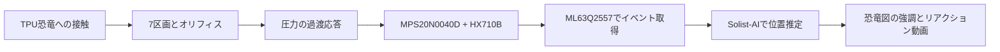

<!-- Product and experiment intent: the physical encoding hypothesis comes before classification. -->
# 企画の核とデモ体験

原案: [concept.md](concept.md)。以下は原案とこのタスクでの追加指示を整理した採用方針。

## 実証したいこと

柔らかい物体の内部構造に接触位置の情報を持たせ、1個の圧力センサーから取り出す。
企画の中心は **Pneumatic Encoding（空気圧ネットワークによる符号化）**。

区画の容積、形状、オリフィス、流路、TPUの変形により、圧力の立ち上がり・ピーク時刻・
減衰・解放時の戻り方に差が出ることを期待する。最終的な静圧が均一になっても、
そこへ至る過渡応答を使えば接触位置を推定できる、という仮説を検証する。

**7区画を区別できることは未実証**。押す強さ・速さ・人の癖が波形差の原因となる可能性もある。
AI導入前に、同じ部位で再現する差と、異なる部位で分かれる差を測る。

## 初期の機械構成

| Zone ID | 部位 | 尻尾からの接続順 |
|---:|---|---:|
| 1 | 尻尾 | 1 |
| 2 | 背中・胴体 | 6 |
| 3 | 右後ろ足 | 2 |
| 4 | 左後ろ足 | 5 |
| 5 | 右前足 | 3 |
| 6 | 左前足 | 4 |
| 7 | 首と頭 | 7 |

接続は **センサー → 1 → 3 → 5 → 6 → 4 → 2 → 7**。
隣り合う区画を6個のオリフィスでつなぐ。Zone IDと経路上の順番を混同しない。

このタスクで指定された設計値:

- 恐竜の大きさは約20 cm（ユーザー申告）。空気室の実容量は未測定。
- 材料はTPUを想定。外殻・隔壁の厚さは1.5 mm。
- 隔壁の連通穴は直径2.5 mm。
- 背中の下の隔壁は右足側から左足側へ30°上がる傾斜。
- 尻尾の取り付け部は内径2.7 mm、外径5.7 mm。
- センサーの口径はユーザー申告で2.5 mm。実物の外径・チューブ適合は実測する。
- ローポリ化による見た目の変化を許容し、扱いやすい軽量モデルにする。

これらは設計値であり、印刷後の肉厚・穴径・気密性の測定結果ではない。
オリフィス径2.5 mmと取り付け部内径2.7 mmは別の寸法。
原案の取り出し口の概略寸法より、このタスクで確定した寸法を優先する。
20 cmという外形寸法だけでは必要な圧力レンジやサンプル速度は決まらない。
押し込み量、内部容積、TPUの硬さ、流路抵抗を含む実測波形で判断する。

## 成功の段階

1. どの区画を押してもセンサーまで圧力変化が届く。
2. 押す位置による過渡波形の差が複数試行で再現する。
3. まず首・頭／背中／足／尻尾の4グループで、未学習の試行を分類する。
4. 左右前後の足を分け、7区画の分類へ拡張する。
5. 強さ・速さ・操作者を変えても成立するか評価する。

4グループでは足を一括表示し、右前足などを識別できたようには見せない。
原案の「安定した分類」の数値基準は未定。精度、区画別再現率、誤反応数、
接触から動画開始までの遅延を測り、初期データを見て合格値を決める。

部位差がほとんど観測できない場合は、オリフィス径・容積・流路・取得系を再検討する。
学習を繰り返すだけで解決できるとは仮定しない。

## 体験と開発画面を分ける

### learning-tool

開発者が実測を確認し、ラベル付きのデータを収集・比較・評価する画面。
後から学習制御とモデル管理を追加する。波形可視化はこのツール内にまとめ、
独立した`src/visualiser/`は初期段階では作らない。

### demo-visualizer

来場者が「どこを触り、恐竜がどう反応したか」を理解できる画面。

- 7区画の恐竜図と、推定された部位の強調表示。
- 部位に対応するユーザー提供の動画。例: 尻尾 → 尻尾を振り回す。
- 同時に実測の圧力波形を表示し、触ったことと応答の関係を見せる。
- 待機、接触検出、判定中、結果、未判定、切断を区別する。
- 判定イベント1回につき動画を開始。同じイベントの再送で毎回先頭に戻さない。
- 動画なし・再生失敗時は部位名と代替表示を出す。

添付の参考画像は図の見せ方の参考。画像の「頭・首を別区画とする6分類」ではなく、
上記の実物と一致する7区画を使う。動画内容は原案の例よりユーザー提供素材を優先する。

AI接続前は**手動プレビュー**を明示する。ボタンで部位と動画を確認できても、
圧力波形から位置を推定した結果として扱わない。生圧力の閾値だけで部位を決めない。
