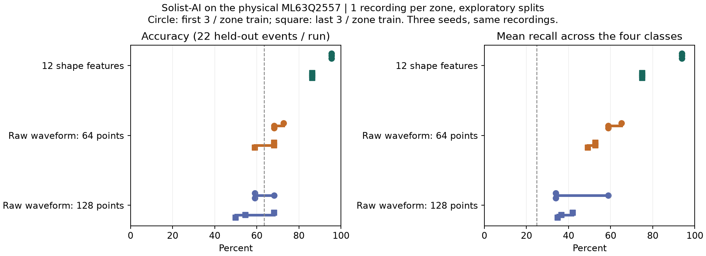
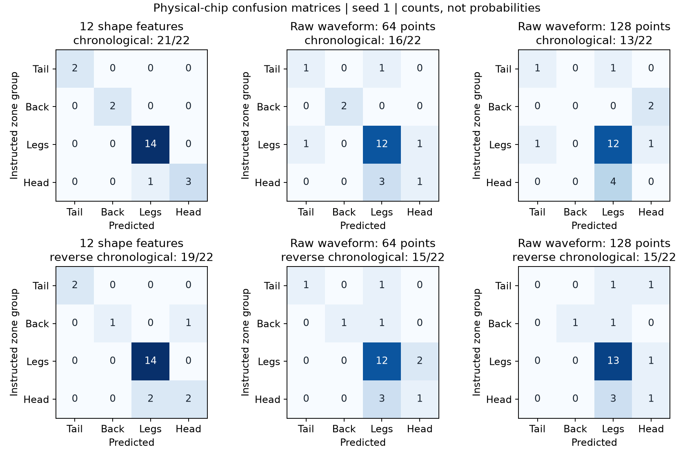

# 保存済み圧力データによるSolist-AI実機学習・4分類比較

実施日: 2026-09-20。対象は `src/pneutouch-solist` の **PneutouchAi**、
DT-EBML63Q2557上のML63Q2557。Debugでビルドし、PneutouchAi WriteをDebug起動して書き込んだ。

## 結論

**再び恐竜を押す操作なしで、保存CSVからSolist-AI実機を学習・評価できた。**
PCはイベントの再生・入力作成・送受信・採点を担当し、学習と推論はチップのODL APIで実行した。
12特徴量、64点波形、128点波形の3方式を、同じ学習・評価分割で比較した。
PC上の最近傍・重心分類器をSolist-AIとして扱った結果ではない。

今回の固定設定と少量データでは、**12特徴量が最初の4分類デモ候補**となる。
波形直接入力も実行できるが、現在の設定では十分な分類性能を得られていない。
波形方式一般の限界を示した実験ではなく、入力スケール・隠れ層・窓長の最適化は行っていない。

| 入力方式 | 前半学習→後半評価 | 後半学習→前半評価 | 4クラス平均再現率：前半／逆順 |
|---|---:|---:|---:|
| 12特徴量 | **21/22 = 95.5%** | **19/22 = 86.4%** | **93.8%／75.0%** |
| 波形64点 | 15–16/22 = 68.2–72.7% | 13–15/22 = 59.1–68.2% | 58.9–65.2%／49.1–52.7% |
| 波形128点 | 13–15/22 = 59.1–68.2% | 11–15/22 = 50.0–68.2% | 33.9–58.9%／34.8–42.0% |

範囲はseed 1/7/42の3実行。特徴量方式は3実行とも同じ正解数だった。
各分割は学習21イベント・評価22イベント。評価には足14、しっぽ2、背中2、首と頭4が含まれる。
「常に足」と答えるだけで全体正解率63.6%となるので、平均再現率も併記した。
逆順の評価と前半の評価は同じ記録を使い回しており、独立した44例として合算しない。



破線は「常に足」と答えた場合の値。点を増やしても独立した収録数は増えない。

## クラス、操作条件、データ

| デモ出力 | 元の区画 |
|---|---|
| 1 しっぽ | Zone 1 |
| 2 背中 | Zone 2 |
| 3 足全体 | Zone 3–6：左右前後の足 |
| 4 首と頭 | Zone 7 |

デモの操作は**約1秒押して離す**。押し始めの時刻は外から与えず、圧力の閾値から検出する。
1秒は操作上の制約で、今回のプログラムが接触時間を正確に測って1秒を強制するわけではない。
クラス0をAIへ学習させていないため、長時間静止や未知の操作を含む連続入力の判定保留は別の課題である。

保存済みの7区画・43完全イベントを使用。元データは
[manifest](analysis/2026-09-20-pressure/manifest.json)とその生CSVに固定し、SHA-256を照合した。
区画ごとの最初の3回を学習、残りを評価する分割と、最後の3回を学習する逆順分割を使用した。
足を統合した後も分割は元の7区画ごとに行い、どの足も学習側へ含めた。
以前のしっぽ・背中16回はC特徴抽出の照合に使い、今回の4分類成績には混ぜていない。

## 入力の作り方と公平性

### 12特徴量

ファームウェアと同じ `pressure_features.c` をPC用Cコンパイラでコンパイルし、CSVを1点ずつ再生した。
特徴は、押し込み側の立ち上がり・減衰・半値幅・面積/ピーク・正規化傾き・非対称性、
解放側の立ち上がり・回復・半値幅・面積/谷、谷/ピーク、負/正の面積比の12個。
圧力の絶対値や区画ラベルを特徴として入力しない。

値を対数変換し、**学習側だけ**で各特徴の平均と標準偏差を求め、`(log(x)-mean)/(3*sd)` とした。
評価側を使ってスケールを決めていない。平均・スケールは実行結果JSONに保存した。
ログ変換と標準化は今回の実機比較ではPC上で行い、チップへ変換済みの12数値を送った。
通常の実機取得モードでは、マイコンが12特徴を抽出し、変換前の特徴をUARTへ出力する。

### 波形64点・128点

同じ自動検出時刻の**200ms前から25ms刻み**で固定長の圧力窓を取り、線形補間する。
検出時刻の825–325ms前の中央値を引き、窓内の最大絶対値で割る。
ピーク位置に合わせた時間移動、イベント長の伸縮、手作業での接触開始指定は行わない。
立ち上がり時間や面積などの特徴へ変換せず、圧力の並びを入力した。
「そのまま」はADCの24bit整数を無加工で渡す意味ではなく、基準値・振幅の補正を施した波形入力を指す。

両方式ともbfloat16へ変換し、学習時と評価時で同じ処理を使う。
ただし、128点波形は特徴方式より長い時間を観測する。入力次元やスケールの影響も異なるので、
同じモデル設定だけで各方式の最高性能を比較したことにはならない。
特に、波形が長いほど同じ入力重みスケールでも隠れ層の飽和状態が変わり得る。

## 実機学習の設定と初期化

リンクしたのは既存プロジェクト同梱の **SolistAi_Library_2_256_64.a**。
ヘッダーの履歴表記は2025-01-14 Ver 1.2.0。別の資料に記載された新SDKとは区別する。
実行時のSDKバージョンAPI値は取得していない。

| 設定 | 値 |
|---|---|
| モデル | 1モデル、入力12/64/128、隠れ32、出力4 |
| 隠れ層活性化 | hard sigmoid |
| 教師 | 正解クラスだけ1、ほか0 |
| 学習 | 4エポック、各エポックで学習21例をシャッフル |
| seed | 1、7、42。SDKのseedと学習順序に指定 |
| 忘却係数／Alphaスケール | 1.0／1.0 |
| Gamma／leak | 0／1.0 |
| 重み初期値 | `ODL_Initialize`→`ODL_Reset`→Beta=0、P=単位行列 |
| 数値形式 | float32上位16bitを使用するbfloat16変換。丸めは切捨て |
| 推論 | `ODL_StartPredict`→完了待ち→`ODL_GetResult`→最大出力クラス |

旧ライブラリのResetだけを使った人工入力試験では、4例を十分に分離できない設定があった。
初期化直後も非ゼロ出力を持っていたため、少量データ用にBetaとPを明示設定した。
これは評価用の恐竜ラベルを見て調整したものではなく、恐竜データの採点前の人工入力試験で決めた。
メーカーライブラリの不具合と断定する検証ではない。

明示初期化後は、12次元の4種類のone-hot人工入力を8回ずつ学習し、**4/4を正しく再現**した。
正解クラスの出力は約0.73–0.83、ほかの出力は約0.05–0.12だった。
これらの出力はsoftmax確率ではない。

評価用コマンドには正解ラベルを載せていない。SDKへ渡す推論時の教師バッファは全ゼロとし、
lossは分類に使わない。予測を受け取った後、PCが保存ラベルと比較する。
各実験でモデルを初期化するため、前の実験の学習を引き継がない。

公式にも[教師あり学習と4出力の分類例](https://fscdn.rohm.com/lapis/jp/products/databook/applinote/ic/micon/Solist-AI_Sim_SupervisedLearning_qs-j.pdf)
がある（PDF p.73–77）。今回の実機成績はその公式サンプルの成績ではなく、本書の圧力入力で測定したもの。

## 誤りの内訳

12特徴の前半学習では、首と頭の4回中1回を足と誤判定した。
逆順では、首と頭の4回中2回を足、背中の2回中1回を首と頭と判定した。
しっぽと足は両分割で全例正解だったが、しっぽの評価例は各分割2回だけである。
足が14/22を占めるため、86.4%という全体正解率だけでは背中・首と頭の弱さが見えにくい。

波形方式では、首と頭を足とする誤りなどが増えた。
128点に増やしても改善は保証されず、今回の設定では64点より悪い場合があった。
固定窓内の押す速さ・保持時間のずれ、入力次元増加、振幅補正、隠れ層の設定が候補要因であり、
どれが原因かをこの比較だけで確定することはできない。



## 時間とメモリ

| 入力 | 実機の推論時間：各実行の中央値 | 最大推論時間 | 学習1例の中央値 |
|---|---:|---:|---:|
| 12特徴 | 104–107.5µs | 111µs | 1.286–1.288ms |
| 波形64点 | 246–249µs | 253µs | 1.428–1.430ms |
| 波形128点 | 421.5–422.5µs | 428µs | 1.603ms前後 |

時間はマイコンのSysTickから読み、API呼出しから完了検出までを測定した。
UART転送、PC上の前処理、結果コピーは含まない。USB転送時間をチップ推論時間として扱っていない。
いずれも40 SPSの25ms間隔より短いが、これは**押してすぐに判定できる時間**を意味しない。

- 12特徴の必要波形が揃うまで: 自動検出から中央値 **1.385秒**、範囲 **1.032–2.316秒**。
- 波形64点の最終格子点: 検出から **1.375秒**。
- 波形128点の最終格子点: 検出から **2.975秒**。
- 補間にはその格子点の直後のサンプルも必要なので、波形窓の実際の準備完了は最大約25ms遅れる。

C特徴抽出の状態領域は2,540byte。ヒープを使わず、224点の履歴と80点の基準値を保持する。
Debugリンクのmapでは `.data` 4byte、`.bss` 5,140byte、予約スタック1,280byteで、通常RAMの予約合計は
**6,424byte / 16,384byte**。AI専用メモリはこの数に含めない。
`llvm-size` のdata欄1,284byteは予約スタックを含むため、初期化変数だけのサイズではない。
text欄は19,124byte。スタックの実測最大使用量、イベント完了時のC特徴抽出時間は未測定。

比較終了時に実機を通常取得へ戻し、15秒間で595サンプル、**39.71 SPS・25/26ms間隔・欠番0**を確認した。
シリアル接続開始時の不完全な先頭行は採点しない。COM7を閉じた後も通常取得ファームウェアを実行させている。

## 実装と再実行

`pressure_features.c` が開始・終了を逐次検出する。32点の安定待ち、基準値との差50,000超が2点、
負側50,000超を経て±25,000以内が8点続くと完了。4秒タイムアウト、欠番、ADC端値では部分波形を破棄する。
閾値は今回の試作データで選んだ値であり、未知の押し方への妥当性は未検証。
7区画43回と以前の16回について、開始・終了時刻は既存Python逐次解析と一致した。
12特徴の差は、局所基準値の取り方などの違いを含め最大0.628%以内だった。
解析解が分かる正負の三角波でも全12特徴の値を照合した。

通常取得では `PNEU1` の生値を維持し、`# PNEE1` でイベント状態、`# PNEF1` の2行で12特徴を送る。
特徴行の数値は元の単位×1000の整数。`pneutouch_features` をデバッガーで監視できる。
特徴抽出と通常の生値取得は実装済みだが、**ライブ入力から4分類結果を自動表示する統合はまだ行っていない**。
学習結果のFeRAM保存・電源再投入後の復元も未実装で、今回の学習は揮発性である。

`ai_validation.c` のPAI1コマンドで通常取得を一時停止し、CRC付きUART入力を学習・推論する。
通信は **CN9 UART-B = COM7、115200 / 8N1**。MCU-LINKのCOM4/5、CN9 SPI-AのCOM6とは別。
MODE切替時は送信をゆっくり行い、通常取得中の小さなUART受信バッファで文字が落ちることを避ける。
60秒コマンドがなければ通常取得へ自動復帰する。AIタイムアウトは4秒でエラーを返す。

リポジトリルートから、現在のファームウェアを書き込み、ほかのCOM7接続を閉じて実行する。

```powershell
.venv/Scripts/python.exe -m pip install -r requirements-analysis.txt pyserial
# Cコンパイラで同じ抽出コードをPC用にビルド（Windowsではzig ccでも可）
cc -std=c11 -Isrc/pneutouch-solist/S_PneuTouch tests/replay_pressure_features.c src/pneutouch-solist/S_PneuTouch/pressure_features.c -o build/replay_pressure_features.exe
.venv/Scripts/python.exe tools/prepare_solist_validation.py
.venv/Scripts/python.exe tools/validate_solist_ai.py --port COM7
.venv/Scripts/python.exe tools/plot_solist_validation.py
```

開始・終了のユーザー操作や新規の押下は不要。実験ごとに学習データを送り直し、終了時にMODE 0を送って通常取得へ戻す。
方式やseedは引数で選べる。設定を変えたら `--output` で別の結果ファイルへ保存する。

## 保存した証拠と限界

| 保存物 | 内容 |
|---|---|
| [入力とC再生照合](analysis/2026-09-20-pressure/results/solist-inputs.json) | 43イベント、3方式の入力、59回の抽出照合 |
| [実機結果](analysis/2026-09-20-pressure/results/solist-chip-validation.json) | 18実験の分割・学習順・前処理・スコア・予測・時間・ライブラリハッシュ |
| [UART記録](analysis/2026-09-20-pressure/results/solist-chip-validation.uart.log) | 実機とのTRAIN/PREDICT要求と応答 |
| [通常取得の復帰確認](analysis/2026-09-20-pressure/results/solist-live-resume.json) | 比較後のレート・欠番 |
| [ビルド・検証識別情報](analysis/2026-09-20-pressure/results/solist-build-verification.json) | ELF、ソースのハッシュ、メモリ、テスト結果 |

現状は**各区画1本の記録内での探索的評価**。同じ恐竜・同じ日の繰り返しは独立な測定ではない。
43例をエポックやseedで繰り返しても新しい実例が増えるわけではない。
別の日、違う握り方、弱い押下、長い保持、連続・同時押下、長時間無操作、未定義部位の拒否性能は確認していない。
物理的な接触開始の真値もないため、センサー応答の到達遅延は測定していない。

まず12特徴量でライブ分類・判定保留を統合する方針が妥当。
波形方式を再検討する際は、入力スケール・隠れ層・窓長を学習側の検証で選び、
区画を交互に収録した別セッションで最終評価する。保存データでその比較処理自体を自動化する土台はできた。
